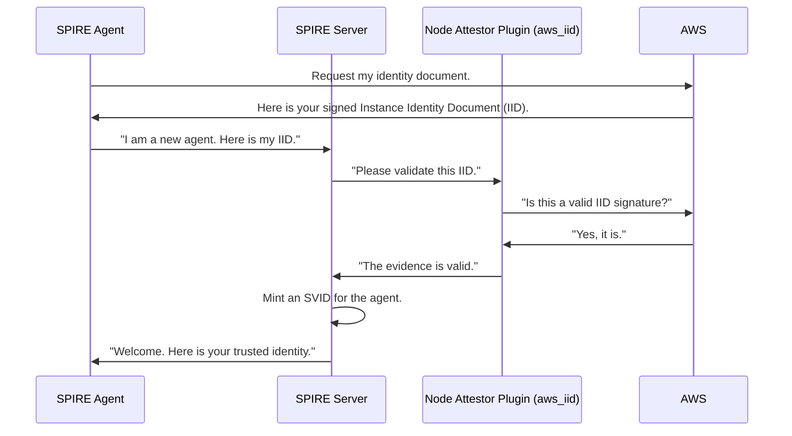
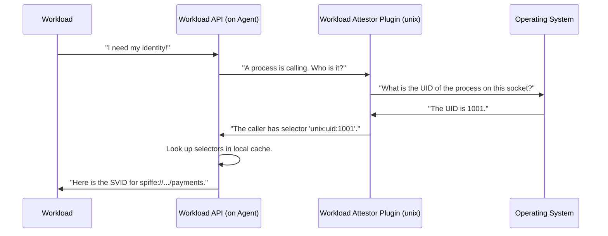

# Chapter 6: Attestation

In our journey so far, we've met the [SPIRE Agent](04_spire_agent_.md) and the [SPIRE Server](05_spire_server_.md). We learned that the server is the central authority, and the agent is its local representative. But this raises a huge question: how does the server know it can trust an agent? How can it be sure an agent is who it claims to be, running on an authorized machine, and not an imposter?

This is where the bedrock of SPIRE's security model comes into play: **Attestation**.

### What is Attestation?

Attestation is the process SPIRE uses to securely verify the identity of a piece of software *without* needing pre-existing secrets like API keys or passwords.

*   **Analogy:** Imagine you're trying to enter a secure building. You don't just tell the security guard your name; you present your government-issued ID card. The guard doesn't just trust the card; they inspect it for verifiable features—the hologram, the photo, the watermark. These features are the **evidence** that proves your identity. Attestation is SPIRE's version of this ID check.

Instead of a hologram, SPIRE uses verifiable evidence from the platform where the software is running. This could be a special document from a cloud provider, a property of the operating system kernel, or a hardware-level certificate.

There are two fundamental types of attestation in SPIRE, forming a chain of trust from the server all the way down to your application.

### Type 1: Node Attestation

**Node Attestation** is how a [SPIRE Agent](04_spire_agent_.md) proves its identity to the [SPIRE Server](05_spire_server_.md). This is the very first thing an agent does when it starts up. It establishes the initial link in the trust chain.

The agent gathers evidence about the node (the physical or virtual machine) it's running on and presents it to the server. The server then uses a corresponding **Node Attestor** [Plugin Architecture](08_plugin_architecture_.md) to validate that evidence.

Some common types of evidence used for node attestation are:
*   **A Join Token:** A simple, one-time-use token that you generate on the server and give to the agent. This is great for simple setups or on-premises machines.
*   **AWS IID:** An "Instance Identity Document" provided and signed by Amazon Web Services. This proves the agent is running on a specific EC2 instance in your AWS account.
*   **Kubernetes PSAT:** A "Projected Service Account Token" that proves the agent is running in a specific pod within a Kubernetes cluster.

Once the server successfully attests the agent, it issues an [SVID](01_svid__spiffe_verifiable_identity_document__.md) to the agent itself. The agent can now use this trusted identity for all future communication.

### Type 2: Workload Attestation

**Workload Attestation** is how your application proves its identity to its local [SPIRE Agent](04_spire_agent_.md). This happens every time your application connects to the [Workload API](03_workload_api_.md).

The agent needs to know exactly which process on the machine is calling it. It uses **Workload Attestor** plugins to discover properties of the calling process directly from the operating system.

Some common properties used for workload attestation are:
*   **Unix UID/GID:** The User ID and Group ID of the process.
*   **Docker Labels:** Labels attached to the Docker container the process is running in.
*   **Kubernetes Namespace/Service Account:** The Kubernetes properties of the pod the process belongs to.

The agent takes these discovered properties and turns them into a set of **selectors**. A selector is a simple key-value pair, like `unix:uid:1001`. These selectors are the workload's unique, verifiable attributes that the agent uses to determine which SPIFFE ID to issue.

### Under the Hood: The Attestation Flow

Let's visualize how these two processes work together.

First, the agent must perform **Node Attestation** with the server. Here we'll use AWS as an example.



Now that the agent is trusted, it can perform **Workload Attestation** for local applications.



### A Peek at the Code

Let's see where this logic lives in the SPIRE codebase.

When a [SPIRE Agent](04_spire_agent_.md) calls the server to attest, the server's `AttestAgent` handler is invoked. It finds the right plugin to handle the type of evidence presented.

```go
// File: pkg/server/api/agent/v1/service.go

func (s *Service) AttestAgent(stream agentv1.Agent_AttestAgentServer) error {
    // ... receive attestation data from agent ...
    attestorType := params.Data.Type

    // Find the right plugin to handle this type of attestation.
    nodeAttestor, ok := s.cat.GetNodeAttestorNamed(attestorType)
    // ... error handling ...

    // Ask the plugin to validate the evidence.
    result, err := nodeAttestor.Attest(ctx, params.Data.Payload, ...)
    // ... error handling ...

    // If successful, sign an SVID for the agent.
    svid, err := s.signSvid(ctx, agentID, params.Params.Csr, log)
    // ...
}
```
This code shows the server acting as the verifier. It receives evidence, delegates the validation to a specialized **NodeAttestor** [Plugin Architecture](08_plugin_architecture_.md), and upon success, mints an [SVID](01_svid__spiffe_verifiable_identity_document__.md) for the agent.

On the agent side, when a workload calls the [Workload API](03_workload_api_.md), the agent's handler first needs to figure out who is calling.

```go
// File: pkg/agent/endpoints/workload/handler.go

func (h *Handler) FetchX509SVID(_ *workload.X509SVIDRequest, stream ...) error {
    ctx := stream.Context()
    
    // 1. Figure out who is calling the API.
    // The attestor inspects the calling process using OS details.
    selectors, err := h.c.Attestor.Attest(ctx)
    // ... error handling ...

    // 2. Use the discovered selectors to find the workload's identity.
    subscriber, err := h.c.Manager.SubscribeToCacheChanges(ctx, selectors)
    // ...
}
```
This code shows the agent using its own attestor to identify the caller and get its selectors. How does it get the process information? It uses a mechanism called a "peer tracker" that can inspect the other side of the local API connection.

```go
// File: pkg/agent/endpoints/peertracker.go

func (a PeerTrackerAttestor) Attest(ctx context.Context) ([]*common.Selector, error) {
    // Get the caller's process information from the connection.
    watcher, ok := peertracker.WatcherFromContext(ctx)
    // ...

    // Pass the PID to the workload attestor plugins (like the 'unix' plugin).
    selectors, err := a.Attestor.Attest(ctx, int(watcher.PID()))
    // ...
    return selectors, nil
}
```
This final piece shows the agent getting the Process ID (PID) of the caller, which it then passes to its **WorkloadAttestor** plugins to generate the selectors.

### Conclusion

You've just learned about the most fundamental security process in SPIRE: Attestation.

*   Attestation is how SPIRE establishes **trust without secrets**, using verifiable evidence from the underlying platform.
*   **Node Attestation** is how a [SPIRE Agent](04_spire_agent_.md) proves its identity to the [SPIRE Server](05_spire_server_.md).
*   **Workload Attestation** is how a workload proves its identity to its local [SPIRE Agent](04_spire_agent_.md).
*   The outcome of attestation is a set of **selectors**—verifiable properties that describe the workload.

So, the agent has now attested a workload and has a list of selectors like `unix:uid:1001` or `k8s:ns:prod`. But how does SPIRE know that a workload with those selectors should be given the SPIFFE ID `spiffe://your-company.com/payments`? That's the final piece of the puzzle.

Next, we'll explore [Registration Entries](07_registration_entries_.md), the rules that map selectors to SPIFFE IDs.

---

Generated by [AI Codebase Knowledge Builder](https://github.com/The-Pocket/Tutorial-Codebase-Knowledge)