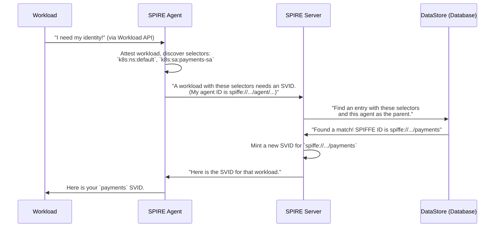

# Chapter 7: Registration Entries

In the [previous chapter on Attestation](06_attestation_.md), we learned how a [SPIRE Agent](04_spire_agent_.md) can securely discover the properties of a workload, such as its Kubernetes service account or the user ID it's running as. The agent now has a set of verifiable facts, or "selectors," like `k8s:sa:payments-sa`.

This leaves us with the final, critical question: How does SPIRE know that a workload with these specific selectors should be given the SPIFFE ID `spiffe://your-company.com/payments`? Who makes that decision?

This is the job of a **Registration Entry**.

### What is a Registration Entry?

A registration entry is a rule you create on the [SPIRE Server](05_spire_server_.md) that maps a set of workload properties to a specific SPIFFE ID.

*   **Analogy:** Think of it as an entry in a country's official citizen registry. The entry is a rule that says: "Anyone who can prove they were born in the city of Springfield (`selector`) is hereby granted citizenship and the name 'Springfield Resident' (`SPIFFE ID`), and this rule is only valid when certified by the Springfield city hall clerk (`parent ID`)."

It's the core policy mechanism in SPIRE. It's how you, the operator, define *which* workloads get *which* identities.

A registration entry has three main parts:

1.  **SPIFFE ID:** The identity that will be issued to the workload if it matches the rule.
2.  **Selectors:** A set of conditions the workload must meet. The selectors discovered during [Attestation](06_attestation_.md) must be a match for the selectors in the entry.
3.  **Parent ID:** The SPIFFE ID of the [SPIRE Agent](04_spire_agent_.md) (or group of agents) that is authorized to attest this workload. This is a powerful security control. It means that even if a workload has the right selectors, it will only get its identity if it's running on a machine that you trust.

### Creating an Entry

Let's create a registration entry for our `payments` service. We've decided that any workload running with the Kubernetes service account `payments-sa` should get the identity `spiffe://your-company.com/payments`.

We use the `spire-server entry create` command to create this rule on the server.

```bash
spire-server entry create \
    -spiffeID "spiffe://your-company.com/payments" \
    -parentID "spiffe://your-company.com/spire/agent/k8s_psat/my-cluster/..." \
    -selector "k8s:ns:default" \
    -selector "k8s:sa:payments-sa"
```

Let's break down this command:
*   `-spiffeID`: The identity we want to assign.
*   `-parentID`: The identity of the [SPIRE Agent](04_spire_agent_.md)s that are allowed to present workloads matching this entry. In this case, we're specifying agents that belong to our Kubernetes cluster named `my-cluster`.
*   `-selector`: The properties the workload must have. Here, we require it to be in the `default` namespace and use the `payments-sa` service account.

When you run this, the server stores this new rule. Now, when a [SPIRE Agent](04_spire_agent_.md) attests a workload and discovers these exact selectors, the server will know exactly which [SVID](01_svid__spiffe_verifiable_identity_document__.md) to mint.

### Under the Hood: The SVID Issuance Flow

Now that we have an entry, let's see how it's used when a workload starts up.



1.  A workload asks its local [SPIRE Agent](04_spire_agent_.md) for an identity.
2.  The agent performs [Workload Attestation](06_attestation_.md) and discovers the workload's selectors.
3.  The agent sends these selectors, along with its own agent ID, to the [SPIRE Server](05_spire_server_.md).
4.  The server queries its database (the DataStore) for a registration entry that matches **both** the selectors **and** the agent's Parent ID.
5.  It finds the entry we just created!
6.  The server mints an [SVID](01_svid__spiffe_verifiable_identity_document__.md) for the SPIFFE ID specified in the entry (`spiffe://your-company.com/payments`).
7.  It sends the SVID back to the agent, which delivers it to the workload.

### A Peek at the Code

Let's see how the `spire-server entry create` command works. It's a client that builds a request and sends it to the server's API.

```go
// File: cmd/spire-server/cli/entry/create.go

func (c *createCommand) Run(ctx context.Context, _ *commoncli.Env, serverClient serverutil.ServerClient) error {
	// ... code to validate flags ...

	// Build a list of entries from the command-line flags.
	entries, err := c.parseConfig()
	// ...

	// Call the server's API to create the entries.
	resp, err := createEntries(ctx, serverClient.NewEntryClient(), entries)
	// ...

	return c.printer.PrintProto(resp)
}
```
This code takes the arguments you provided (`-spiffeID`, `-parentID`, etc.), packs them into a request, and sends it to the [SPIRE Server](05_spire_server_.md).

The server then receives this request and stores the entry in its database. What does an entry look like in the database? Here's the simplified Go struct that SPIRE uses to represent an entry.

```go
// File: pkg/server/datastore/sqlstore/models.go

// RegisteredEntry holds a registered entity entry in the database.
type RegisteredEntry struct {
	Model

	EntryID  string `gorm:"unique_index"`
	SpiffeID string `gorm:"index"`
	ParentID string `gorm:"index"`

	// A list of conditions the workload must meet.
	Selectors []Selector
	
	// ... other fields like TTL, Admin, etc. ...
}
```
This `RegisteredEntry` struct directly maps to a table in the server's database. It clearly shows the three core components we discussed: the `SpiffeID` to be issued, the `ParentID` of the attesting agent, and the list of `Selectors` the workload must possess.

Finally, here's a glimpse of the API handler on the server that receives the request to create an entry.

```go
// File: pkg/server/api/entry/v1/service.go

func (s *Service) createEntry(ctx context.Context, e *types.Entry, ...) *entryv1.BatchCreateEntryResponse_Result {
	// 1. Convert the incoming API request into the internal datastore format.
	cEntry, err := api.ProtoToRegistrationEntry(ctx, s.td, e)
	// ... error handling ...

	// 2. Save the new entry to the database.
	regEntry, existing, err := s.ds.CreateOrReturnRegistrationEntry(ctx, cEntry)
	// ... error handling ...

	// 3. Convert the created entry back to the API format and return it.
	tEntry, err := api.RegistrationEntryToProto(regEntry)
	// ...
	return &entryv1.BatchCreateEntryResponse_Result{
		Status: api.OK(),
		Entry:  tEntry,
	}
}
```
This function is the server's endpoint for creating entries. It receives the request from the CLI, converts it into the database model we just saw, and tells the datastore to save it.

### Conclusion

You've now learned about the final piece of the core identity-issuing puzzle: the Registration Entry.

*   A registration entry is a **rule on the SPIRE server** that acts as the system's policy engine.
*   It **maps a workload's properties (selectors) to a specific SPIFFE ID**.
*   It includes a **Parent ID** to ensure that only trusted [SPIRE Agent](04_spire_agent_.md)s can attest a given workload.
*   You manage these entries using the `spire-server entry` command-line tool.
*   They are the critical link between the discovery process of [Attestation](06_attestation_.md) and the issuance of a final, trusted [SVID](01_svid__spiffe_verifiable_identity_document__.md).

Throughout this tutorial, we've mentioned that many parts of SPIRE, like the different methods for attestation, are "pluggable." But what does that really mean?

Next, we'll explore the powerful [Plugin Architecture](08_plugin_architecture_.md) that makes SPIRE so flexible and adaptable to any environment.

---

Generated by [AI Codebase Knowledge Builder](https://github.com/The-Pocket/Tutorial-Codebase-Knowledge)