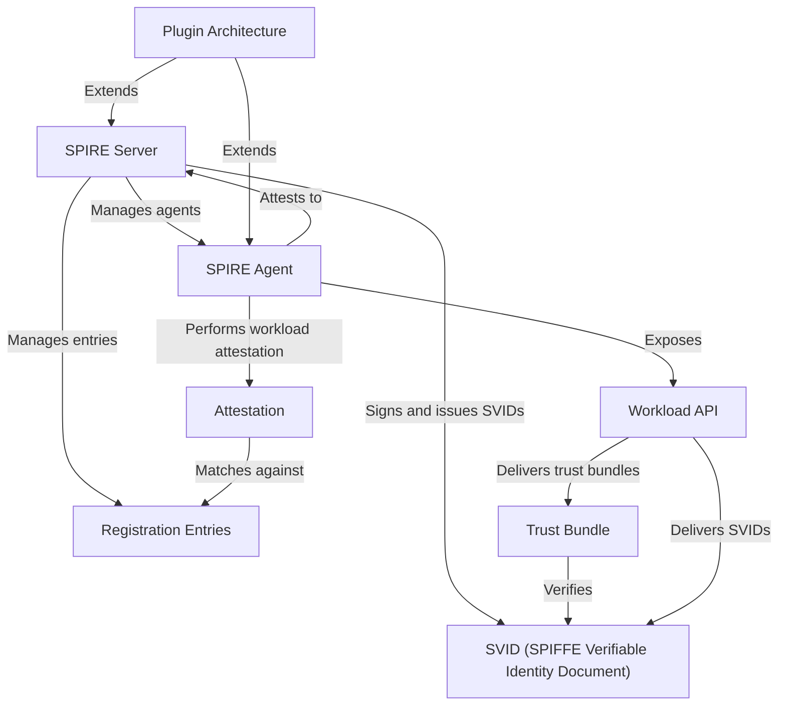

# Tutorial: spire

SPIRE is like an automated, secure passport office for software.
A central **SPIRE Server** acts as the main authority that manages identities, while a **SPIRE Agent** runs on every machine acting as a local branch.
The agent performs *attestation*—a process to securely verify a local application's identity—and then provides it with a short-lived, automatically renewed cryptographic identity document called an *SVID*.
Applications fetch their SVIDs and the necessary trust material from the agent's local **Workload API**.

**Source Repository:** [None](None)

## Chapters

1. [SVID (SPIFFE Verifiable Identity Document)
](01_svid__spiffe_verifiable_identity_document__.md)
2. [Trust Bundle
](02_trust_bundle_.md)
3. [Workload API
](03_workload_api_.md)
4. [SPIRE Agent
](04_spire_agent_.md)
5. [SPIRE Server
](05_spire_server_.md)
6. [Attestation
](06_attestation_.md)
7. [Registration Entries
](07_registration_entries_.md)
8. [Plugin Architecture
](08_plugin_architecture_.md)

---

Generated by [AI Codebase Knowledge Builder](https://github.com/The-Pocket/Tutorial-Codebase-Knowledge)