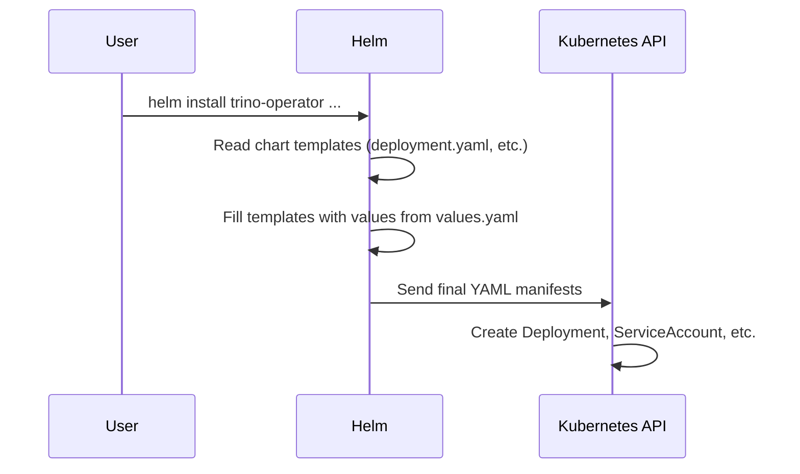

# Chapter 1: Operator Deployment (via Helm)

Welcome to the `trino-operator` tutorial! Before you can create powerful Trino clusters in Kubernetes, you first need to install the tool that manages them: the Trino Operator. This chapter will guide you through installing the operator itself.

### The Goal: Hiring a Manager for Your Trino Clusters

Imagine you want to manage an apartment complex (your Trino clusters). Doing everything yourself—handling maintenance, collecting rent, finding tenants—is a lot of work. It's much easier to hire a specialized apartment manager.

The Trino Operator is that specialized manager for your Trino clusters on Kubernetes. But before the manager can start working, you need to "onboard" them. This involves:

1.  Giving them an office to work from.
2.  Providing them with a set of keys to access the different apartments.
3.  Giving them an official name badge so everyone knows who they are.

This entire onboarding process is handled by a package manager for Kubernetes called **Helm**. The package we'll use is called a **Helm chart**.

The Trino Operator Helm chart is the installation package that sets up our "manager" in your Kubernetes cluster.

### What is Helm?

Think of Helm as an app store for Kubernetes. Just like you use `apt` on Ubuntu or the App Store on your phone to install software, you use Helm to install applications on Kubernetes. It bundles all the necessary configuration files into a single, easy-to-manage package called a **chart**.

### What's Inside the Trino Operator Chart?

When you install the `trino-operator` Helm chart, it creates a few key resources in your Kubernetes cluster. Let's stick with our apartment manager analogy:

*   **Deployment**: This is the manager's office. It creates a Pod where the operator's code actually runs.
*   **ServiceAccount**: This is the manager's name badge. It gives the operator a unique identity within the Kubernetes cluster.
*   **ClusterRole & ClusterRoleBinding**: These are the manager's keys. They grant the operator the specific permissions it needs to do its job, like creating and managing Trino clusters. We will explore this in detail in [Chapter 5: Operator Permissions (RBAC)](05_operator_permissions__rbac__.md).

### Let's Deploy the Operator!

Now for the fun part. Let's get the operator running in your cluster with a few simple commands.

**Step 1: Add the Stackable Helm Repository**

First, you need to tell Helm where to find the `trino-operator` chart. This is like adding a new store to your app store's list.

```bash
helm repo add stackable https://repo.stackable.tech/repository/helm-stable/
helm repo update
```

This command adds the official Stackable chart repository and updates your local list to make sure you have the latest versions.

**Step 2: Install the Operator Chart**

Now, you can install the operator. We'll install it into a dedicated `namespace` (a sort of workspace in Kubernetes) called `stackable-operators`.

```bash
helm install trino-operator stackable/trino-operator \
  --namespace stackable-operators \
  --create-namespace
```

This command tells Helm to install the `trino-operator` chart from the `stackable` repository. The `--create-namespace` flag conveniently creates the workspace for you if it doesn't already exist.

**Step 3: Verify the Installation**

After a moment, the operator should be up and running. You can check its status by looking for its Pod.

```bash
kubectl get pods --namespace stackable-operators
```

You should see an output similar to this, with the status `Running`:

```text
NAME                                         READY   STATUS    RESTARTS   AGE
trino-operator-deployment-5f7b8c9d4b-abcde   1/1     Running   0          60s
```

Congratulations! You've successfully hired and onboarded your Trino cluster manager. It's now running and waiting for instructions.

### Under the Hood: How Does it Work?

When you run `helm install`, Helm acts as a mail-merge tool for Kubernetes configurations. It takes template files, fills in the blanks with configuration values, and sends the final result to Kubernetes.

Here is a simplified view of what happens:



Let's peek at a few of the files inside the chart to see how this works.

#### The Chart's "ID Card": `Chart.yaml`

This file contains metadata about the chart, like its name and version.

```yaml
# deploy/helm/trino-operator/Chart.yaml
apiVersion: v2
name: trino-operator
version: "0.0.0-dev"
description: The Stackable Operator for Trino
```

This is like the label on the outside of the box, telling Helm what's inside.

#### The Configuration Menu: `values.yaml`

This file holds all the default configuration options that you can customize. For example, it defines the container image for the operator.

```yaml
# deploy/helm/trino-operator/values.yaml
image:
  repository: oci.stackable.tech/sdp/trino-operator
  pullPolicy: IfNotPresent
```

If you wanted to use a different version of the operator, you could override these values during installation.

#### The Blueprints: `templates/deployment.yaml`

The `templates` directory contains blueprint files. Helm reads these files and fills in the placeholders `{{ ... }}` with values from `values.yaml`.

Here’s a tiny snippet of the template that defines the operator's container:

```yaml
# deploy/helm/trino-operator/templates/deployment.yaml
# ... (other details skipped for clarity)
spec:
  template:
    spec:
      containers:
        - name: {{ include "operator.appname" . }}
          image: "{{ .Values.image.repository }}:{{ .Values.image.tag | default .Chart.AppVersion }}"
```

See how `{{ .Values.image.repository }}` is a placeholder? Helm replaces it with the `repository` value from `values.yaml` to generate the final configuration that gets sent to Kubernetes.

#### The Key Box: `templates/roles.yaml`

This template defines the permissions our operator needs. For example, to manage Trino clusters, it needs permission to interact with `trinoclusters` resources.

```yaml
# deploy/helm/trino-operator/templates/roles.yaml
- apiGroups:
    - trino.stackable.tech
  resources:
    - trinoclusters
  verbs:
    - get
    - list
    - watch
```

This rule gives our "manager" the keys to `get`, `list`, and `watch` all the Trino cluster "apartments."

### Conclusion

In this chapter, we learned that the Trino Operator is a manager for our Trino clusters and that we must first install it before we can use it. We used a Helm chart to deploy the operator, which neatly packaged its running program (Deployment), its identity (ServiceAccount), and its permissions (ClusterRole).

Now that our manager is on the job, it’s time to give it its first task: creating a Trino cluster!

In the next chapter, we will learn how to do just that using the [`TrinoCluster` Custom Resource](02__trinocluster__custom_resource_.md).

---

Generated by [AI Codebase Knowledge Builder](https://github.com/The-Pocket/Tutorial-Codebase-Knowledge)