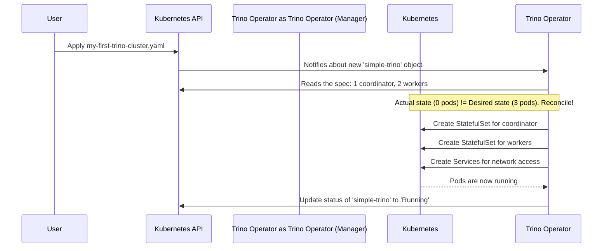

# Chapter 2: `TrinoCluster` Custom Resource

In the [previous chapter](01_operator_deployment__via_helm__.md), we successfully installed the Trino Operator. Think of this as hiring a skilled factory manager for our custom-built computers. Now that the manager is on the job, it's time to give them their first order.

### The Goal: Ordering Your First Trino Cluster

How do you tell the operator what kind of Trino cluster you want? You don't call the operator or send it an email. Instead, you fill out a special order form and submit it to the Kubernetes system. This "order form" is called the **`TrinoCluster` Custom Resource**.

It's a blueprint where you specify everything about your desired cluster:

*   How many "brain" nodes (coordinators) you want.
*   How many "muscle" nodes (workers) you need.
*   The exact version of the Trino software to use.
*   Any special configurations.

The operator's entire job is to watch for these order forms and work tirelessly to build, deliver, and maintain the exact cluster you described.

### What is a "Custom Resource"?

Out of the box, Kubernetes knows about standard resources like `Pods`, `Deployments`, and `Services`. By installing the Trino Operator in Chapter 1, we taught our Kubernetes cluster a new word: `TrinoCluster`.

A **Custom Resource (CR)** is like adding a new, specialized type of object to Kubernetes's vocabulary. This allows us to manage complex applications like Trino in a simple, Kubernetes-native way.

### Let's Create a Simple Cluster

Let's start by creating a minimal `TrinoCluster`. Our goal is to deploy a small Trino setup with one coordinator and two workers.

**Step 1: Write the "Order Form"**

Create a new file named `my-first-trino-cluster.yaml` and add the following content. This YAML file is our `TrinoCluster` resource.

```yaml
# my-first-trino-cluster.yaml
apiVersion: trino.stackable.tech/v1alpha1
kind: TrinoCluster
metadata:
  name: simple-trino
spec:
  image:
    productVersion: "476"
  coordinator:
    roleGroups:
      default:
        replicas: 1
  workers:
    roleGroups:
      default:
        replicas: 2
```

Let's break down this simple order form:

*   **`apiVersion` & `kind`**: This tells Kubernetes exactly what kind of resource this is. In this case, it's a `TrinoCluster`.
*   **`metadata.name`**: This is the unique name for our cluster, `simple-trino`.
*   **`spec.image.productVersion`**: We're ordering Trino version `476`.
*   **`spec.coordinator`**: Here we define the "brain" of our cluster. We're asking for `1` replica (instance).
*   **`spec.workers`**: Here we define the "muscle." We're asking for `2` replicas.

**Step 2: Submit the Order**

Now, we submit this file to Kubernetes using the `kubectl` command-line tool.

```bash
kubectl apply -f my-first-trino-cluster.yaml
```

When you run this, you're handing the order form to Kubernetes. The Trino Operator, which is always watching, will immediately see it and get to work.

**Step 3: Check the Status**

You can see the operator's progress by checking on the `TrinoCluster` resource itself and the Pods it's creating.

First, check the `TrinoCluster` status:
```bash
kubectl get trinoclusters
```

You should see an output like this, which will eventually show a `Running` status:
```text
NAME           STATUS    COORDINATORS   WORKERS   AGE
simple-trino   Running   1              2         2m
```

Next, check the actual Pods being created. Pods are the containers where the Trino software runs.
```bash
kubectl get pods
```

You'll see one coordinator pod and two worker pods being created. After a minute or two, they will all be in the `Running` state.
```text
NAME                      READY   STATUS    RESTARTS   AGE
simple-trino-coord-0      1/1     Running   0          90s
simple-trino-worker-0     1/1     Running   0          85s
simple-trino-worker-1     1/1     Running   0          85s
```

Congratulations! You've just used the `TrinoCluster` resource to declaratively create a fully functional Trino cluster.

### Under the Hood: From Blueprint to Reality

What actually happened when you ran `kubectl apply`? How did a simple YAML file turn into running Trino pods?

The magic is in the operator's **reconciliation loop**.

1.  **Watch**: The operator continuously watches the Kubernetes API for any changes to `TrinoCluster` resources.
2.  **Compare**: When you create or update a `TrinoCluster`, the operator compares the *desired state* (your YAML file) with the *actual state* (what's currently running in the cluster).
3.  **Act**: If the actual state doesn't match the desired state, the operator takes action to "reconcile" them.

For a new cluster, the operator sees that there are zero running pods (actual state) but you want one coordinator and two workers (desired state). So, it starts creating the necessary Kubernetes resources.



The operator doesn't just create Pods directly. It creates higher-level resources like **StatefulSets** (which ensure your pods have stable names like `simple-trino-worker-0`) and **Services** (which give your cluster a stable network address).

The permissions to create these resources were granted to the operator back in Chapter 1. If you look at the `roles.yaml` file from the Helm chart, you'll see rules allowing the operator to manage `statefulsets` and `services`.

```yaml
# A snippet from the operator's permissions
- apiGroups:
    - apps
  resources:
    - statefulsets
  verbs:
    - create
    - delete
    - list
    - watch
```

This is the "key" that allows our factory manager to access the workshop and build the components we ordered.

### Conclusion

In this chapter, we learned about the most important concept for using the `trino-operator`: the `TrinoCluster` Custom Resource. It acts as a declarative blueprint for our Trino cluster. We simply define *what* we want, and the operator handles the complex task of *how* to build and run it.

Our new Trino cluster is running, but it can't query any data yet because it's not connected to any data sources. It's like having a powerful computer with no files or internet connection.

In the next chapter, we will learn how to connect our cluster to data sources using the [`TrinoCatalog` Custom Resource](03__trinocatalog__custom_resource_.md).

---

Generated by [AI Codebase Knowledge Builder](https://github.com/The-Pocket/Tutorial-Codebase-Knowledge)