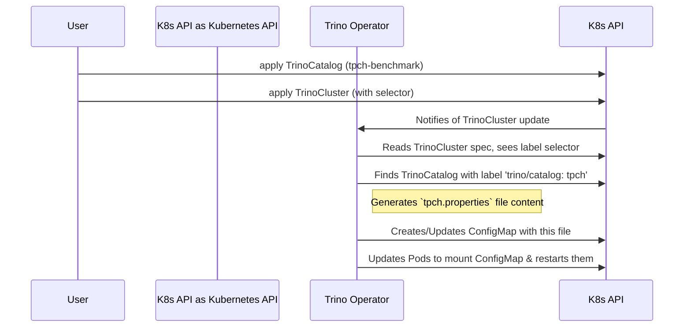

# Chapter 3: `TrinoCatalog` Custom Resource

In the [previous chapter](02__trinocluster__custom_resource_.md), we created our first `TrinoCluster`. It's up and running, but it's like a brand new office with phones that can't dial out—it isn't connected to any data sources, so we can't actually query anything.

### The Goal: Giving Your Trino Cluster a "Contact Card" for Data

Trino's power comes from its ability to query data wherever it lives. To do this, it needs connection details for each data source, such as a database, a data lake, or even just a built-in data generator. These connection configurations are called **catalogs**.

Instead of stuffing all this connection information directly into our `TrinoCluster` definition, the `trino-operator` uses a much cleaner approach: a separate `TrinoCatalog` Custom Resource.

Think of it this way:
*   Your `TrinoCluster` is the **office**.
*   A `TrinoCatalog` is a **contact card**. Each card holds the connection details for one specific data source.

Our goal in this chapter is to create a simple "contact card" for Trino's built-in test data generator (called TPC-H) and give it to our cluster.

### What is a `TrinoCatalog`?

A `TrinoCatalog` is another special "order form" we taught Kubernetes about when we installed the operator. Its sole purpose is to define the configuration for a single Trino catalog.

This design has a huge advantage: **reusability**. You can define a `TrinoCatalog` once and have multiple `TrinoCluster` instances use it. If you need to update the connection details (like a password), you only have to change it in one place.

### Let's Create Our First Catalog

We'll start by creating a catalog that connects to the TPC-H connector, which is a fantastic tool for generating sample data to test queries.

**Step 1: Write the "Contact Card"**

Create a new file named `tpch-catalog.yaml` and add the following content.

```yaml
# tpch-catalog.yaml
apiVersion: trino.stackable.tech/v1alpha1
kind: TrinoCatalog
metadata:
  name: tpch-benchmark
  labels:
    trino/catalog: tpch
spec:
  connectorName: tpch
```

Let's look at this simple file:
*   `kind: TrinoCatalog`: We are defining a catalog, our "contact card".
*   `metadata.name: tpch-benchmark`: A unique name for this catalog resource.
*   `metadata.labels`: This is the most important part! Labels are like tags. We've tagged this card with `trino/catalog: tpch`. This is how our cluster will find it.
*   `spec.connectorName: tpch`: This tells Trino to use the built-in `tpch` connector.

**Step 2: Submit the Catalog to Kubernetes**

Just like with our cluster, we use `kubectl` to create the resource.

```bash
kubectl apply -f tpch-catalog.yaml
```

This command creates the `TrinoCatalog` object in Kubernetes. Right now, it's just sitting there, like a contact card in a box, waiting to be used.

### Connecting the Catalog to Your Cluster

Now we need to tell our `simple-trino` cluster to use this new catalog. We do this by updating our `TrinoCluster` definition to look for any catalogs with the label we just created.

**Step 1: Update the `TrinoCluster`**

Open your `my-first-trino-cluster.yaml` file from the previous chapter and add the `catalogs` section.

```yaml
# my-first-trino-cluster.yaml
apiVersion: trino.stackable.tech/v1alpha1
kind: TrinoCluster
metadata:
  name: simple-trino
spec:
  image:
    productVersion: "476"
  catalogs:
    catalogLabelSelector:
      matchLabels:
        trino/catalog: tpch
  coordinator:
    # ... (rest of the file is the same)
```

The new section, `spec.catalogs.catalogLabelSelector`, tells the `simple-trino` cluster: "Find all `TrinoCatalog` objects that have the label `trino/catalog: tpch` and load them."

**Step 2: Apply the Changes**

Now, apply the updated cluster definition.

```bash
kubectl apply -f my-first-trino-cluster.yaml
```

The Trino Operator will detect this change. To apply the new catalog, it will perform a safe, rolling restart of your Trino pods. You can watch this happen with `kubectl get pods --watch`.

Once the pods are restarted and `Running`, your Trino cluster is now connected to the TPC-H data source! You can connect a client and run queries like `SHOW SCHEMAS FROM tpch;`.

### Under the Hood: The Label Hunt

How did the operator connect these two separate objects? It's all about watching and matching labels.

1.  **Watch**: The operator watches for changes to both `TrinoCluster` and `TrinoCatalog` resources.
2.  **Match**: When you updated `simple-trino`, the operator read its `catalogLabelSelector`. It then searched the whole Kubernetes cluster for `TrinoCatalog` objects that matched the label `trino/catalog: tpch`.
3.  **Generate**: It found our `tpch-benchmark` catalog. The operator then read its spec (`connectorName: tpch`) and generated the contents of a Trino configuration file named `tpch.properties`.
4.  **Deploy**: The operator created a Kubernetes `ConfigMap` to hold this `tpch.properties` file and mounted it into the Trino pods, triggering a restart so they would load the new catalog.

This process is designed for clean separation and dynamic configuration.



The permission to find these `TrinoCatalog` objects was granted to the operator when we installed it via Helm. If we peek inside the Helm chart's permissions file, we can see the rule that gives the operator access.

```yaml
# deploy/helm/trino-operator/templates/roles.yaml
# ...
  - apiGroups:
      - trino.stackable.tech
    resources:
      - trinocatalogs
    verbs:
      - get
      - list
      - watch
# ...
```

This rule explicitly gives our "manager" the keys to `get`, `list`, and `watch` all the `TrinoCatalog` "contact cards."

### Conclusion

In this chapter, we learned about the `TrinoCatalog` custom resource, a clean and reusable way to define data source connections. We saw how a `TrinoCluster` uses label selectors to dynamically discover and load these catalogs. This modular design keeps our main cluster definition simple while allowing for powerful and flexible data source management.

Our cluster is now functional, but what if we need more advanced configuration options for our catalogs or for Trino itself? How do we know what fields are available?

In the next chapter, we will explore the [Trino Configuration Schema](04_trino_configuration_schema_.md), which defines all the available options for customizing your Trino setup.

---

Generated by [AI Codebase Knowledge Builder](https://github.com/The-Pocket/Tutorial-Codebase-Knowledge)