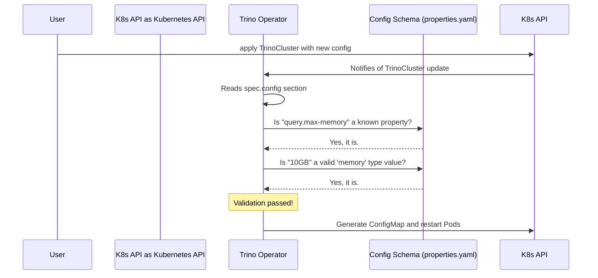

# Chapter 4: Trino Configuration Schema

In the [previous chapter](03__trinocatalog__custom_resource_.md), we successfully connected our `TrinoCluster` to a data source using a `TrinoCatalog`. Our cluster is working, but what if we need to fine-tune its performance or change its behavior? Trino has hundreds of configuration properties, and getting them right can be tricky.

### The Goal: Configuring Trino Safely

Imagine you need to increase the maximum memory a single query can use. The Trino documentation says there's a property called `query.max-memory`. You might ask yourself:

*   Did I spell the property name correctly? Is it `query.max-memory` or `query-max-memory`?
*   What kind of value does it expect? A number? A string with "GB" at the end?
*   Which configuration file does it belong in? `config.properties`? `jvm.config`?
*   Does this setting apply to the coordinator, the workers, or both?

Making a mistake with any of these can lead to a broken cluster. The **Trino Configuration Schema** is a built-in safety net that solves this exact problem.

Think of it as an intelligent, auto-validating form for your Trino settings. It knows all the valid fields, what kind of data they accept, and where they belong. It prevents you from submitting an invalid "form," saving you from common configuration errors.

### What is the Trino Configuration Schema?

The Trino Configuration Schema is a structured definition, written in a YAML file, that contains a complete list of all Trino properties that the `trino-operator` knows about. This file is bundled with the operator itself.

For every single property, the schema defines:

*   **Property Name**: The exact name, like `query.max-memory`.
*   **File Location**: Which file it goes into (e.g., `config.properties`).
*   **Data Type**: The expected format (e.g., `boolean`, `integer`, or a special `memory` type).
*   **Default Value**: The value used if you don't provide one.
*   **Target Role**: Whether it applies to the `coordinator`, `worker`, or both.

The operator uses this schema as its "source of truth" to validate any custom configurations you provide in your [`TrinoCluster` Custom Resource](02__trinocluster__custom_resource_.md).

### Let's Use the Schema to Tune Our Cluster

Let's try to solve our initial problem: increasing the query memory. We want to set `query.max-memory` to `10GB`.

**Step 1: A Peek at the Schema Definition**

We don't need to read the whole file, but let's look at a small, simplified snippet from the schema (`properties.yaml`) that defines our target property.

```yaml
# A simplified snippet from deploy/config-spec/properties.yaml

- property:
    propertyNames:
      - name: "query.max-memory"
        kind:
          type: "file"
          file: "config.properties"
    datatype:
      type: "string"
      unit: "memory" # This specifies a pattern like "10GB", "512MB"
    defaultValues:
      - value: "50GB"
    roles:
      - name: "coordinator"
      - name: "worker"
```

This short definition tells us everything we need to know:
*   The property name is `query.max-memory`.
*   It belongs in the `config.properties` file.
*   It expects a `memory` value (e.g., `10GB`).
*   It applies to both the `coordinator` and the `worker`.

**Step 2: Update the `TrinoCluster` Resource**

Armed with this information, we can now confidently update our `my-first-trino-cluster.yaml` file. We'll add a `config` block to both the coordinator and worker sections.

```yaml
# my-first-trino-cluster.yaml
apiVersion: trino.stackable.tech/v1alpha1
kind: TrinoCluster
metadata:
  name: simple-trino
spec:
  # ... image and other sections remain the same
  coordinator:
    roleGroups:
      default:
        replicas: 1
        config:
          config.properties:
            query.max-memory: "10GB"
  workers:
    roleGroups:
      default:
        replicas: 2
        config:
          config.properties:
            query.max-memory: "10GB"
```

The new `config` section is structured by file name. We're telling the operator: "In the `config.properties` file, set the `query.max-memory` key to the value `10GB`."

**Step 3: Apply the Changes**

Now, apply the updated configuration.
```bash
kubectl apply -f my-first-trino-cluster.yaml
```

The operator will see this change and immediately validate it against its internal schema. Since `10GB` is a valid memory format for the `query.max-memory` property, the operator will accept the change, generate the new `config.properties` file, and perform a rolling restart of the pods to apply the new setting.

**What if we made a mistake?**

Let's say we made a typo and used `query.max.memory` instead.
```yaml
# An INCORRECT example
config:
  config.properties:
    query.max.memory: "10GB" # Typo in the property name
```
When you apply this, the operator's validation will fail! It will check its schema, see that `query.max.memory` is not a known property, and reject the change. It will then update the status of the `TrinoCluster` resource with a helpful error message, telling you exactly what went wrong. This instant feedback is incredibly valuable for preventing broken deployments.

### Under the Hood: The Validation Check

How does the operator perform this check? It's a simple but powerful validation step in its reconciliation loop.

1.  **Watch**: The operator sees that the `simple-trino` `TrinoCluster` object has been updated.
2.  **Read**: It reads the desired configuration from the `spec`, for example, `spec.coordinator.config`.
3.  **Validate**: For each property in the `config` block, it looks it up in its internal Trino Configuration Schema. It checks the name, the data type, and the value format.
4.  **Act**:
    *   **If valid:** It proceeds to generate the final configuration files and apply them to the cluster.
    *   **If invalid:** It stops the reconciliation process for that object and writes an error message to the object's `.status` field.

This workflow acts as a protective gateway, ensuring only valid configurations ever reach your running Trino pods.



This built-in schema is defined in the file `deploy/config-spec/properties.yaml` within the operator's source code and is loaded into the operator when it starts. You can always refer to this file as the ultimate source of truth for supported properties.

### Conclusion

In this chapter, we learned about the Trino Configuration Schema, a critical feature that provides a safety net for configuring your cluster. It acts as a structured, validated blueprint for all available Trino properties, allowing the operator to catch errors early and guide you toward a correct and stable setup. By using this schema, the operator transforms configuration from a guessing game into a predictable and safe process.

So far, we've seen the operator create pods, manage configurations, and reconcile state. But how does it get the *permission* from Kubernetes to perform all these actions?

In the next chapter, we will pull back the curtain on Kubernetes security and explore [Operator Permissions (RBAC)](05_operator_permissions__rbac__.md).

---

Generated by [AI Codebase Knowledge Builder](https://github.com/The-Pocket/Tutorial-Codebase-Knowledge)