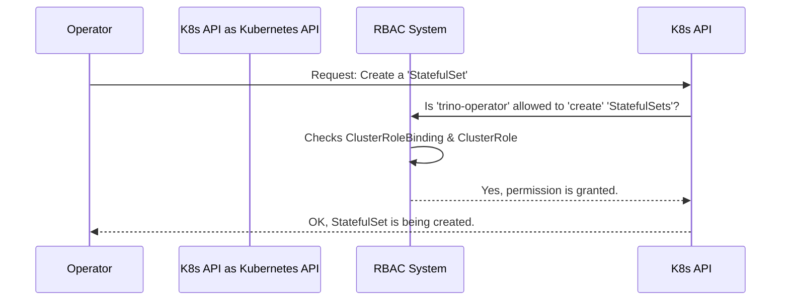

# Chapter 5: Operator Permissions (RBAC)

In the [previous chapter](04_trino_configuration_schema_.md), we learned how the Trino Operator uses a schema to safely manage configurations. We saw that when you change a `TrinoCluster` resource, the operator takes action: it generates new `ConfigMaps` and restarts `Pods`. But this raises a very important question: How is the operator *allowed* to do all of this?

### The Goal: Giving Our Manager the Right Keys

When we installed the operator in [Chapter 1](01_operator_deployment__via_helm__.md), we didn't just hire a manager for our Trino clusters; we also gave them a set of keys. We wouldn't give a building superintendent a master key that opens every resident's apartment. That would be a huge security risk! Instead, we give them a specific key ring with keys that *only* open the utility rooms, supply closets, and other areas they need to do their job.

In Kubernetes, this concept is called **Role-Based Access Control (RBAC)**. It's the security system that defines exactly what the Trino Operator is allowed to do. Our goal is to understand this "key ring" and see why it's a critical part of running an operator safely.

The Trino Operator's "key ring" needs keys to:
*   The "boiler room" (`StatefulSets`, which manage Trino `Pods`).
*   The "electrical panel" (`Services`, which handle networking).
*   The "supply closets" (`ConfigMaps`, which store configuration).
*   Its own "order forms" (`TrinoCluster` and `TrinoCatalog` custom resources).

By limiting the operator's access to only these resources, we follow the **principle of least privilege**, ensuring it has just enough permission to do its job and nothing more.

### The Three Pieces of Kubernetes RBAC

Kubernetes RBAC is built on three simple ideas that work together:

1.  **Subject**: The "who." This is the user or program asking for permission. For our operator, this is its official identity, called a **`ServiceAccount`**. Think of this as the manager's official name badge.
2.  **Role**: The "what." This is a list of permissions, like "can create `Pods`" or "can read `ConfigMaps`." Our operator uses a **`ClusterRole`**, which is a set of permissions that applies across the entire cluster. This is the manager's key ring.
3.  **Binding**: The "link." This connects a specific "who" to a specific "what." A **`ClusterRoleBinding`** gives the `ServiceAccount` (the name badge) the `ClusterRole` (the key ring).

When you installed the operator with Helm, all three of these—the `ServiceAccount`, the `ClusterRole`, and the `ClusterRoleBinding`—were created for you.

### Let's Look at the Operator's "Key Ring"

We don't need to create these files ourselves, but we can peek inside the Helm chart to see what permissions the operator was granted.

#### 1. The Name Badge (`ServiceAccount`)

The Helm chart creates an identity for the operator. Here is a simplified version of the `serviceaccount.yaml` template:

```yaml
# deploy/helm/trino-operator/templates/serviceaccount.yaml
apiVersion: v1
kind: ServiceAccount
metadata:
  name: trino-operator-serviceaccount
```

This tiny file simply creates a unique identity named `trino-operator-serviceaccount` inside our Kubernetes cluster. This is the "who."

#### 2. The Key Ring (`ClusterRole`)

This is the most interesting part. The `roles.yaml` template defines all the permissions. Let's look at a few simplified rules from that file.

**Permission to manage Trino Pods and networking:**
```yaml
# A snippet from deploy/helm/trino-operator/templates/roles.yaml
- apiGroups:
    - "apps"
  resources:
    - "statefulsets"
  verbs:
    - "create"
    - "get"
    - "list"
    - "watch"
    - "delete"
```
This rule gives the operator the "keys" to create, read, and delete `StatefulSets`. The operator uses this permission to launch and manage the Trino coordinator and worker pods.

**Permission to manage its own Custom Resources:**
```yaml
# A snippet from deploy/helm/trino-operator/templates/roles.yaml
- apiGroups:
    - "trino.stackable.tech"
  resources:
    - "trinoclusters"
    - "trinocatalogs"
  verbs:
    - "get"
    - "list"
    - "watch"
```
This rule allows the operator to watch for the `TrinoCluster` and `TrinoCatalog` "order forms" that we submit.

#### 3. Giving the Keys to the Manager (`ClusterRoleBinding`)

Finally, we need to connect the `ServiceAccount` to the `ClusterRole`. The `ClusterRoleBinding` does exactly that.

```yaml
# deploy/helm/trino-operator/templates/serviceaccount.yaml
apiVersion: rbac.authorization.k8s.io/v1
kind: ClusterRoleBinding
metadata:
  name: trino-operator-clusterrolebinding
subjects:
  - kind: ServiceAccount
    name: trino-operator-serviceaccount # The "who"
roleRef:
  kind: ClusterRole
  name: trino-operator-clusterrole # The "what"
  apiGroup: rbac.authorization.k8s.io
```
This file says: "Take the user `trino-operator-serviceaccount` and give them all the permissions defined in the `trino-operator-clusterrole`."

### Under the Hood: The Security Checkpoint

How does Kubernetes use these rules? Every single time the operator tries to do something, Kubernetes checks its permissions.

Let's imagine you just created a `TrinoCluster`. The operator sees it and decides it needs to create a `StatefulSet` for the Trino pods.

1.  **Request**: The Trino Operator sends a request to the Kubernetes API: "Please create a `StatefulSet` named `simple-trino-coord`."
2.  **Authentication**: The Kubernetes API sees the request comes from the `trino-operator-serviceaccount`.
3.  **Authorization**: The API then asks its internal RBAC system: "Does the `trino-operator-serviceaccount` have permission to `create` `statefulsets`?"
4.  **Decision**: The RBAC system looks at all the `ClusterRoleBindings`, finds the one for our operator, checks the attached `ClusterRole`, and sees the rule allowing it. It replies "Yes, permission granted."
5.  **Action**: The Kubernetes API proceeds to create the `StatefulSet`.

If the operator tried to do something it wasn't allowed to, like deleting a `Secret` in a different part of the cluster, the RBAC system would say "No," and the API would reject the request with a "Forbidden" error.



This security check happens for every single action, ensuring the operator stays within its designated boundaries.

### Conclusion

In this chapter, we pulled back the curtain on Kubernetes security and learned about Role-Based Access Control (RBAC). We saw that the Trino Operator doesn't have unlimited power; instead, it operates with a specific set of permissions granted to it during installation. This "key ring," defined by a `ClusterRole`, ensures the operator follows the principle of least privilege, making it a safe and trusted manager for our Trino clusters.

We have now covered the core concepts of how to deploy the operator, how to use it to create and configure Trino clusters, and how it is secured. The final piece of the puzzle is understanding how the operator project itself is built and released.

In the next chapter, we will explore the project's engineering practices in [Build and Release Automation](06_build_and_release_automation_.md).

---

Generated by [AI Codebase Knowledge Builder](https://github.com/The-Pocket/Tutorial-Codebase-Knowledge)