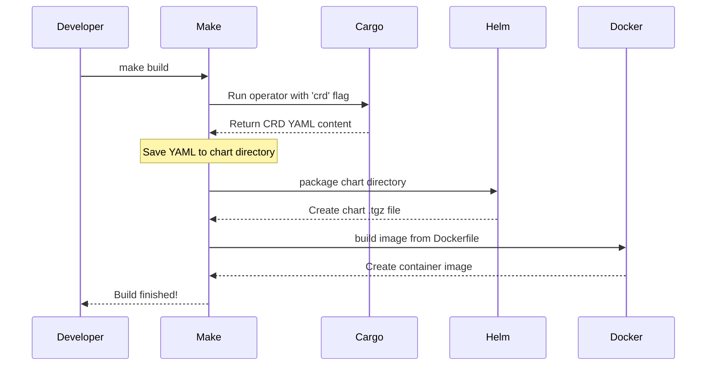

# Chapter 6: Build and Release Automation

In the [previous chapter](05_operator_permissions__rbac__.md), we explored how the operator is given specific permissions to do its job safely. We have now covered how the operator works, how to use it, and how it's secured. The final piece of the puzzle is to understand how the operator software itself is built and packaged for release.

### The Goal: An Automated Assembly Line for Code

Imagine a car factory. You don't build a car by having one person run around grabbing parts at random. Instead, you have a highly organized, automated assembly line. Raw materials like steel and plastic go in one end, and a finished, tested, and ready-to-ship car comes out the other. Every step—stamping the metal, painting the body, installing the engine—is defined and automated to ensure every car is built exactly the same way.

The `trino-operator` project uses the same principle for its software. The "raw materials" are the source code and configuration files. The "assembly line" is a file called a **`Makefile`**. This file defines a series of automated steps to:

1.  Compile the operator's source code.
2.  Build the operator's container image.
3.  Package the Helm chart that we used in [Chapter 1](01_operator_deployment__via_helm__.md).
4.  Automatically regenerate configuration files to keep everything in sync.

The goal of this chapter is to understand how this `Makefile`-driven assembly line works, ensuring a consistent and repeatable process for creating releases and simplifying the workflow for developers.

### What is a `Makefile`?

A `Makefile` is like a recipe book for your command line. It contains a list of "recipes" (called *targets*) that you can ask it to make. Each recipe has a name and a list of shell commands to run.

Instead of remembering a long, complex command to build a container image, a developer can simply run `make docker-build`. This is easier to remember, less prone to typos, and guarantees that everyone on the team builds the image in the exact same way.

### Let's Look at the Assembly Line's Blueprints

The `Makefile` in the `trino-operator` project defines several important recipes. Let's look at a few of the most important ones.

#### The Master Recipe: `build`

The main recipe for building everything is `build`. If you were to look at a simplified version of the `Makefile`, you'd see something like this:

```makefile
# A simplified view from the Makefile
build: regenerate-charts helm-package docker-build
```
This recipe is very simple. It says that to `build`, you first need to complete three other recipes: `regenerate-charts`, `helm-package`, and `docker-build`. Let's see what each of those does.

#### Recipe 1: Building the Container Image (`docker-build`)

This recipe builds the container image that runs the operator.

```makefile
# A simplified view from the Makefile
docker-build:
	docker build -t "oci.stackable.tech/sdp/trino-operator:..." .
```
This command tells Docker to build an image using the `Dockerfile` in the project. This `Dockerfile` contains the instructions for packaging our compiled operator code into a runnable container.

The `Dockerfile` itself has a few simple steps, like a cooking recipe:
```dockerfile
# Simplified snippet from docker/Dockerfile

# 1. Start with a minimal base operating system
FROM registry.access.redhat.com/ubi9/ubi-minimal:latest

# 2. Copy the compiled operator program into the image
COPY stackable-trino-operator /usr/local/bin/

# 3. Tell the container what program to run when it starts
ENTRYPOINT ["stackable-trino-operator"]
```
This process takes our code and packages it into the self-contained image that Kubernetes uses to run the operator pod.

#### Recipe 2: Packaging the Helm Chart (`helm-package`)

This recipe creates the Helm chart `.tgz` file that you use to install the operator.

```makefile
# A simplified view from the Makefile
helm-package:
	helm package deploy/helm/trino-operator
```
This command uses the `helm` tool to take the directory containing the chart's templates (which we explored in Chapter 1) and bundle it into a single, versioned archive file. This is the final product that gets published to a Helm repository.

#### Recipe 3: Keeping Things in Sync (`regenerate-charts`)

This is one of the most clever parts of the automation. Remember the [`TrinoCluster`](02__trinocluster__custom_resource_.md) and [`TrinoCatalog`](03__trinocatalog__custom_resource_.md) custom resources? Their definitions are written in the operator's source code. This recipe automatically generates the YAML files for them and puts them inside the Helm chart.

```makefile
# A simplified view from the Makefile
crds:
	cargo run --bin stackable-trino-operator -- crd > deploy/helm/trino-operator/crds/crds.yaml
```
This command actually compiles and runs the operator program with a special argument `crd`. In this mode, the operator doesn't start managing clusters; instead, it just prints out its own Custom Resource Definitions (CRDs) as YAML. The `Makefile` saves this output directly into the chart.

This ensures that the Helm chart *always* contains the exact CRD definitions that match the operator's code, preventing any mismatches.

### Under the Hood: Running the Assembly Line

Let's trace what happens when a developer makes a change and wants to create a new build.

1.  **Start the Line**: The developer runs a single command in their terminal: `make build`.
2.  **Generate CRDs**: `make` sees that `build` depends on `regenerate-charts`. It runs the `cargo run ... -- crd` command, updating the CRD files inside the `deploy/helm/trino-operator/crds/` directory.
3.  **Package Chart**: Next, `make` runs the `helm-package` recipe. Helm reads the chart directory (including the freshly generated CRDs) and creates a file like `trino-operator-0.0.0.tgz`.
4.  **Build Image**: Finally, `make` runs the `docker-build` recipe. It compiles the Rust code and then uses the `Dockerfile` to build a new container image tagged with the current version.
5.  **Done**: The process is complete! The developer now has a new container image and a new Helm chart, both perfectly in sync and ready for testing or release.



This entire automated process prevents human error and ensures that every single build is created in exactly the same way. It's the engine that drives reliable and consistent software development for the `trino-operator`.

### Conclusion

In this chapter, we learned about the `Makefile`-based automation that acts as the project's assembly line. It automates all the critical build and release tasks, from compiling code and building container images to packaging the Helm chart and regenerating configuration. This ensures a consistent, repeatable, and simple workflow for developers.

You have now completed the entire `trino-operator` tutorial! You started by deploying the operator as a user, learned to define clusters and catalogs, understood its configuration schema and security model, and finally, peeked behind the curtain to see how the project itself is built.

Congratulations on finishing the course! You are now well-equipped to use, configure, and even contribute to the `trino-operator`.

---

Generated by [AI Codebase Knowledge Builder](https://github.com/The-Pocket/Tutorial-Codebase-Knowledge)