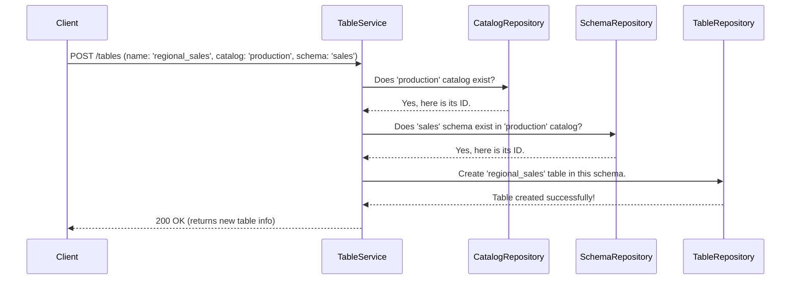

# Chapter 1: Three-Level Namespace (Catalog > Schema > Asset)

Welcome to your first step in mastering `unitycatalog`! Before we can manage data, models, or any other assets, we need a way to organize them. Imagine walking into a massive library with no signs, no sections, and no card catalog—finding a specific book would be impossible! This chapter introduces the simple but powerful "addressing system" that `unitycatalog` uses to prevent this chaos.

### The Problem: Organizing a World of Data

Let's imagine a company, "CosmoCorp". They have different teams working with different kinds of data:
*   The **Sales** team has data about product sales and revenue.
*   The **Marketing** team has customer information and campaign results.
*   The **Data Science** team builds machine learning models to predict customer behavior.

How can CosmoCorp store all these assets without them becoming a jumbled mess? How do they ensure the Sales team doesn't accidentally modify a machine learning model, or the Marketing team can't see sensitive revenue figures?

They need a logical, hierarchical way to store and find everything. This is precisely the problem the three-level namespace solves.

### The Solution: A Library for Your Data

`unitycatalog` organizes everything into a simple three-level hierarchy. The best analogy is a physical library:

1.  **Catalog**: The entire library building. This is the highest level of organization. A company might have a `production` catalog for live data and a `development` catalog for testing.
2.  **Schema**: A specific floor or section in the library, like "Fiction" or "History". A schema groups related assets together within a catalog. For CosmoCorp, this could be a `sales` schema and a `marketing` schema.
3.  **Asset**: The individual item on the shelf. This could be a `Table`, a `Volume` (for files), a `Function`, or a machine learning `Model`.

This structure gives every single asset a unique, easy-to-understand address, just like a book's location in a library.

The full address for an asset is written as `catalog_name.schema_name.asset_name`.

For our CosmoCorp example, the organization would look like this:

```mermaid
graph TD
    A[production (Catalog)] --> B[sales (Schema)];
    A --> C[marketing (Schema)];
    A --> D[data_science (Schema)];

    B --> B1[revenue_2023 (Table)];
    B --> B2[quarterly_reports (Volume)];

    C --> C1[customers (Table)];
    C --> C2[email_campaigns (Table)];

    D --> D1[churn_prediction (Model)];
    D --> D2[calculate_discounts (Function)];
```

Here, the unique address for the customer data table would be `production.marketing.customers`. Simple, clear, and predictable!

### Under the Hood: How the System Finds an Asset

When you ask the system for an asset like a table, it uses this three-part name to navigate the hierarchy. Let's see how `unitycatalog` handles a request to create a new table.

#### A Step-by-Step Walkthrough

Imagine a user wants to create a new table called `regional_sales` inside the `sales` schema of the `production` catalog.

Here’s a simplified sequence of what happens inside the server:



The system validates each level of the namespace (`Catalog` then `Schema`) before finally operating on the `Asset` (`Table`). This ensures that assets are always placed in a valid, existing location.

#### A Glimpse into the Code

Let's look at a simplified piece of the `TableService.java` code that handles table creation. Don't worry about the Java syntax; focus on the logic.

```java
// From: server/src/main/java/io/unitycatalog/server/service/TableService.java

public HttpResponse createTable(CreateTable createTable) {
    // The 'createTable' object contains the full path:
    // createTable.getCatalogName() -> "production"
    // createTable.getSchemaName()  -> "sales"
    // createTable.getName()        -> "regional_sales"

    // The repository handles finding the right catalog/schema
    // and creating the table in the database.
    TableInfo tableInfo = tableRepository.createTable(createTable);

    // ... setup permissions for the new table ...

    return HttpResponse.ofJson(tableInfo);
}
```
This code snippet shows that when a request comes in to create a table, the `CreateTable` object contains the full `catalog_name` and `schema_name`. The `tableRepository` then uses this information to correctly place the new table in the database.

This same pattern applies to all other asset types. For example, creating a registered model in `ModelService.java` also requires a `catalog_name` and `schema_name`.

```java
// From: server/src/main/java/io/unitycatalog/server/service/ModelService.java

public HttpResponse createRegisteredModel(CreateRegisteredModel createRegisteredModel) {
    // The 'createRegisteredModel' object also contains
    // the full catalog and schema path for the new model.
    RegisteredModelInfo modelInfo =
        modelRepository.createRegisteredModel(createRegisteredModel);
    
    // ... setup permissions for the new model ...
    
    return HttpResponse.ofJson(modelInfo);
}
```
This consistent structure makes the whole system easy to understand and use. No matter what kind of asset you are working with, you always use the same `Catalog > Schema > Asset` addressing system.

### Conclusion

You've just learned the single most important concept in `unitycatalog`: the **Three-Level Namespace**. This `Catalog > Schema > Asset` hierarchy is the backbone of the entire system. It provides a simple, logical structure for organizing all your data and AI assets, ensuring everything has a unique and predictable address.

This organization isn't just for tidiness—it's also the foundation for security. Now that we understand how assets are structured, we can learn how to control who is allowed to see and use them.

In the next chapter, we will build directly on this concept to explore the [Authorization Framework](02_authorization_framework_.md).

---

Generated by [AI Codebase Knowledge Builder](https://github.com/The-Pocket/Tutorial-Codebase-Knowledge)