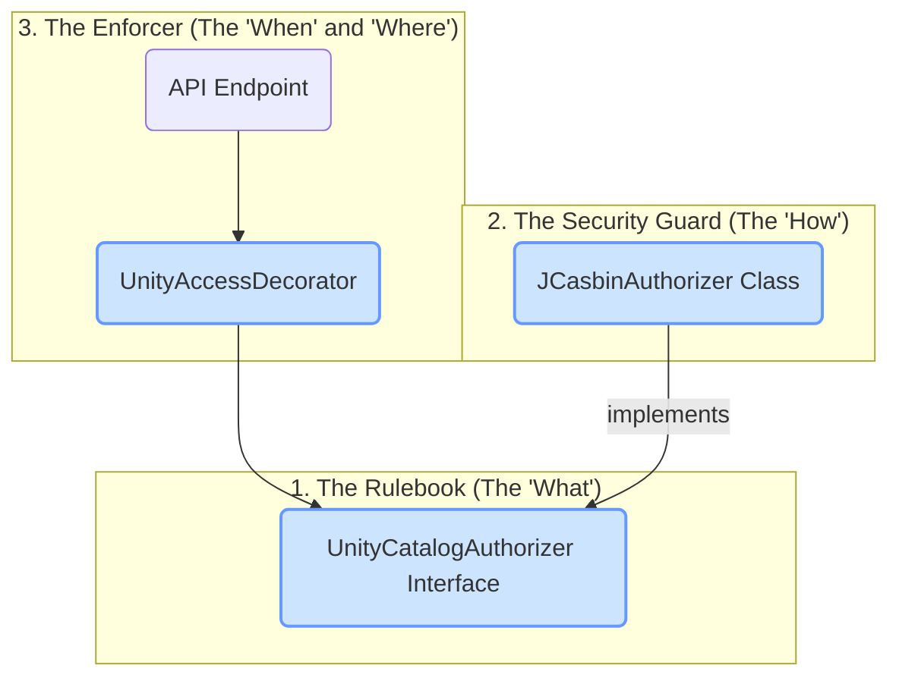
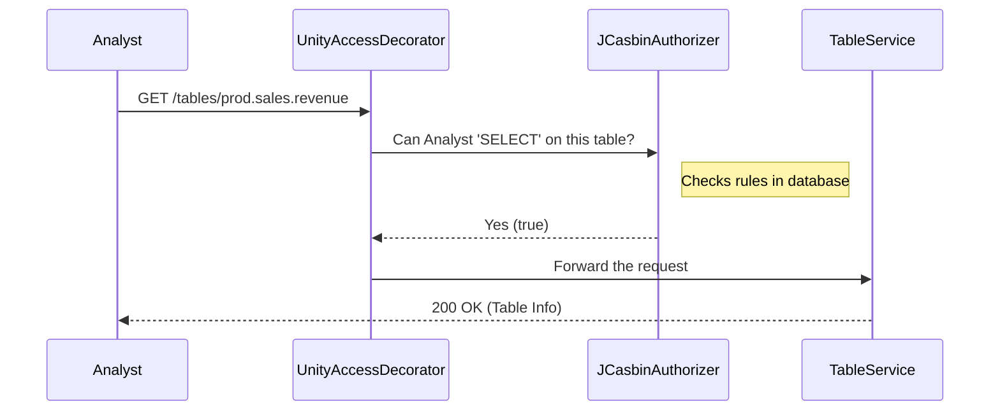

# Chapter 2: Authorization Framework

In the [previous chapter](01_three_level_namespace__catalog___schema___asset__.md), we learned how `unitycatalog` organizes all data and AI assets into a neat, three-level library system: `Catalog > Schema > Asset`. This structure gives every item a clear address.

Now that our library is organized, we need a security guard. Who is allowed to read which books? Who can add new books to a section? And who is in charge of the whole library? This chapter introduces the `unitycatalog` Authorization Framework—the security system that controls access to every single asset.

### The Problem: Controlling Access in a Shared Library

Let's return to our company, "CosmoCorp". They have organized their assets like this:

*   `production.sales.revenue_2023` (Table)
*   `production.marketing.customers` (Table)
*   `production.data_science.churn_prediction` (Model)

Now, they face a new challenge:
*   A **Sales Analyst** needs to *read* the `revenue_2023` table but should *not* be able to see the `customers` table.
*   A **Data Scientist** needs to *use* the `churn_prediction` model and *read* the `customers` table, but should *not* be able to change sales data.
*   An **Administrator** needs to be able to grant these permissions to others.

How can the system enforce these different rules for different people on different assets? This is where the Authorization Framework comes in.

### The Solution: A Three-Part Security System

The framework is like a high-tech security system for our data library. It has three main components that work together to protect your assets.

1.  **The Rulebook (`UnityCatalogAuthorizer` interface):** This is a blueprint that defines *what* a security system must be able to do. It doesn't do the work itself; it just lists the required jobs, like `grantPermission`, `revokePermission`, and `checkPermission`.
2.  **The Security Guard (`JCasbinAuthorizer` class):** This is the actual implementation of the rulebook. It's the guard who reads the rules and makes decisions. `unitycatalog` uses a powerful, well-known security library called jCasbin to act as its guard.
3.  **The Automatic Door Scanner (`UnityAccessDecorator` and `@AuthorizeExpression`):** This is a scanner placed at the entrance of every room (every API endpoint). Before anyone can enter, the scanner automatically checks their ID against a specific rule. The `@AuthorizeExpression` is the instruction you give the scanner, telling it which rule to check.

Let's see how these parts fit together.



### 1. The Rulebook: `UnityCatalogAuthorizer`

This is the starting point. It's an "interface" in Java, which is just a contract or a list of required functions. It ensures that any security system we plug into `unitycatalog` can perform the essential tasks.

Think of it as a job description for a security guard.

```java
// From: server/src/main/java/io/unitycatalog/server/auth/UnityCatalogAuthorizer.java

public interface UnityCatalogAuthorizer {
  // Can this user perform this action on this resource?
  boolean authorize(UUID principal, UUID resource, Privileges action);

  // Give a user permission to perform an action.
  boolean grantAuthorization(UUID principal, UUID resource, Privileges action);

  // Take away a user's permission.
  boolean revokeAuthorization(UUID principal, UUID resource, Privileges action);

  // ... other security-related functions ...
}
```

This interface defines the core security operations. The most important one is `authorize`, which answers the simple question: "Is this user allowed to do this?"

### 2. The Security Guard: `JCasbinAuthorizer`

This class is the actual worker who fulfills the contract defined by `UnityCatalogAuthorizer`. It uses an external library called **jCasbin** to store and check permissions efficiently. When another part of the system asks, "Can this user read this table?", the `JCasbinAuthorizer` checks its internal list of rules (stored in a database) and returns `true` or `false`.

```java
// From: server/src/main/java/io/unitycatalog/server/auth/JCasbinAuthorizer.java

public class JCasbinAuthorizer implements UnityCatalogAuthorizer {
  private final Enforcer enforcer; // The jCasbin engine

  // ... constructor setup ...

  @Override
  public boolean authorize(UUID principal, UUID resource, Privileges action) {
    // Asks the jCasbin engine to enforce the rule.
    return enforcer.enforce(
        principal.toString(), resource.toString(), action.toString());
  }

  // ... other implemented methods ...
}
```
This code shows how `JCasbinAuthorizer` uses its internal `enforcer` to do the actual check. It's the brain of the security operation.

### 3. The Automatic Door Scanner: `UnityAccessDecorator`

This is where the magic happens for API developers. Instead of manually writing code to call the security guard for every single request, we can use a simple Java "annotation" to automate the security check.

An annotation is like a sticky note you put on your code that gives it special instructions. In our case, the `@AuthorizeExpression` tells the `UnityAccessDecorator` to automatically secure an API endpoint.

Let's imagine we have an API endpoint to get information about a table. We want to ensure only users with `SELECT` permission can use it.

```java
// Example from a service like TableService.java

// This annotation is the key!
@AuthorizeExpression("#authorize(#principal, #table, 'SELECT')")
public TableInfo getTable(String tableName) {
  // ... code to fetch the table from the database ...
  return tableInfo;
}
```
This is incredibly powerful!
*   `@AuthorizeExpression(...)`: This "sticky note" tells the system: "Before running this `getTable` function, perform a security check."
*   `#authorize(...)`: This is the rule to check.
*   `#principal`: A special variable representing the current user making the request.
*   `#table`: A special variable representing the table the user is trying to access.
*   `'SELECT'`: The specific permission (or "privilege") we are checking for.

When a request comes in to this endpoint, the `UnityAccessDecorator` intercepts it *before* the `getTable` code runs. It evaluates the expression, which calls our `JCasbinAuthorizer`, and either allows the request to proceed or immediately blocks it with a "Permission Denied" error.

### Under the Hood: A Request's Journey

Let's follow a request from our Sales Analyst to see the `revenue_2023` table and see how these components work together.

1.  The Sales Analyst sends a request: `GET /api/2.1/unity-catalog/tables/production.sales.revenue_2023`.
2.  The `UnityAccessDecorator`, our automatic door scanner, intercepts the request before it reaches the main service logic.
3.  The decorator sees the `@AuthorizeExpression("#authorize(#principal, #table, 'SELECT')")` annotation on the target method.
4.  It identifies the `#principal` (the Sales Analyst) and the `#table` (the `revenue_2023` table).
5.  It calls the `authorize` method on our `JCasbinAuthorizer` (the security guard).
6.  The `JCasbinAuthorizer` looks up its rules in the database and finds a rule that says "Sales Analyst has 'SELECT' privilege on `revenue_2023`". It returns `true`.
7.  Since the check passed, the decorator allows the request to proceed to the `TableService`, which fetches and returns the table information.

Here is a simplified diagram of this flow:


Now, if the Marketing Intern made the same request, the `JCasbinAuthorizer` would not find a matching rule, would return `false` at step 6, and the decorator would immediately block the request, sending back a "Permission Denied" error. The `TableService` code would never even run!

### Conclusion

You've just learned how `unitycatalog` secures your data with its powerful and flexible **Authorization Framework**. This system separates the *rules* from the *enforcement*, making it both secure and easy to use.

*   The **`UnityCatalogAuthorizer`** interface defines the contract for what a security system can do.
*   The **`JCasbinAuthorizer`** is the concrete implementation that manages and checks permissions.
*   The **`UnityAccessDecorator`** uses simple **`@AuthorizeExpression`** annotations to automatically protect API endpoints, ensuring no request goes unchecked.

Now that we understand how assets are organized and secured, we're ready to see how it all comes together. In the next chapter, we'll explore the core engine that runs everything: the [Unity Catalog Server](03_unity_catalog_server_.md).

---

Generated by [AI Codebase Knowledge Builder](https://github.com/The-Pocket/Tutorial-Codebase-Knowledge)