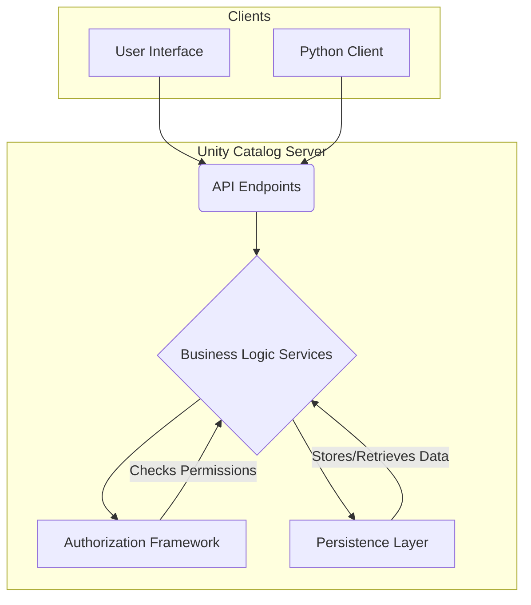
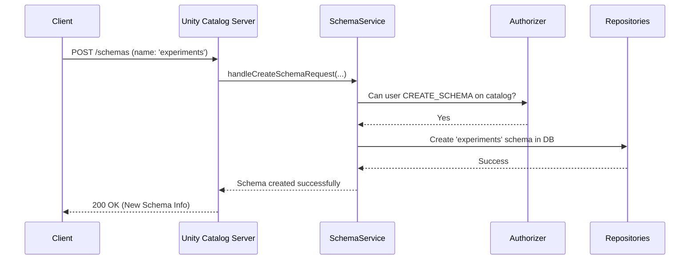

# Chapter 3: Unity Catalog Server

In the [previous chapter](02_authorization_framework_.md), we set up a powerful security system, our "Authorization Framework," to guard our data library. We now have an organized library structure ([Three-Level Namespace](01_three_level_namespace__catalog___schema___asset__.md)) and a security guard to protect it.

But who runs the library? Who takes your request to check out a book, finds it on the shelf, and updates the records? We need a central engine to manage all operations. This chapter introduces the heart of our project: the **Unity Catalog Server**.

### The Problem: A Library Needs a Librarian

Imagine you walk into our organized and secure data library. You want to create a new "section" (a Schema) called `experiments` inside the "development" floor (a Catalog).

You can't just walk over and start building shelves. You need to submit a request to the head librarian. This librarian must:
1.  Receive your request.
2.  Check with the security guard if you have permission to create new sections.
3.  If approved, update the library's master floor plan (the database) with the new section.
4.  Confirm to you that the new section has been created.

This "head librarian" is exactly the role the Unity Catalog Server plays. It's the central backend component that listens for requests, applies the rules, and makes things happen.

### The Solution: A Central Engine for All Operations

The Unity Catalog Server is the core engine that brings all our concepts together. It's a standalone application that runs continuously, waiting for requests from users or other programs. It's the single source of truth for all your metadata.

The server has several key responsibilities:

1.  **Listens for Requests (The API):** It exposes a set of HTTP endpoints (an API) that clients can call. For example, a `POST /api/2.1/unity-catalog/schemas` request is how a client asks to create a new schema.
2.  **Executes Business Logic (The Services):** For each type of asset, there's a corresponding "service" inside the server. A `SchemaService` knows all the rules for creating, deleting, and listing schemas. A `TableService` does the same for tables.
3.  **Enforces Security (The Authorizer):** Before executing any logic, the server consults the [Authorization Framework](02_authorization_framework_.md) to ensure the user has the required permissions.
4.  **Manages State (The Persistence Layer):** After a change is approved, the server instructs the [Persistence Layer (Repositories & DAOs)](09_persistence_layer__repositories___daos__.md) to save the new information (like a new schema) to the database.



This diagram shows that all clients talk *only* to the server's API. The server then orchestrates everything internally, acting as the central brain.

### Under the Hood: Creating a Schema

Let's follow a request to create our `experiments` schema from start to finish to see how the server works.

1.  A client sends a request: `POST /api/2.1/unity-catalog/schemas` with details like the catalog name (`development`) and the new schema name (`experiments`).
2.  The Unity Catalog Server receives this request at its API endpoint.
3.  It routes the request to the `SchemaService`.
4.  The `SchemaService` first asks the `Authorizer`: "Does the current user have `CREATE_SCHEMA` permission on the `development` catalog?"
5.  The `Authorizer` checks its rules and replies "Yes."
6.  The `SchemaService` then tells the `SchemaRepository` (part of the persistence layer): "Create a new schema named `experiments` in the database under the `development` catalog."
7.  The repository saves the new schema and confirms success.
8.  The server sends a `200 OK` response back to the client with information about the newly created schema.

Here's that flow in a sequence diagram:



### A Glimpse into the Code

The main entry point for the entire application is `UnityCatalogServer.java`. This file is responsible for building and starting the server, including wiring up all the different services.

Let's look at a simplified snippet of how the server initializes and connects the `SchemaService`.

```java
// From: server/src/main/java/io/unitycatalog/server/UnityCatalogServer.java

private Server initializeServer(...) {
    // ...
    // Create the security guard (Authorizer) and database tools (Repositories)
    UnityCatalogAuthorizer authorizer = initializeAuthorizer(...);
    Repositories repositories = new Repositories(...);

    // Create the specialist librarian for schemas
    SchemaService schemaService = new SchemaService(authorizer, repositories);

    // Connect the "/api/.../schemas" URL to our schemaService
    armeriaServerBuilder
        .annotatedService(BASE_PATH + "schemas", schemaService);
    // ... connect other services like TableService, CatalogService, etc.
    return armeriaServerBuilder.build();
}
```

This code is like the blueprint for our library's management office.
1.  It first gets the `authorizer` (security guard) and `repositories` (database tools).
2.  It then creates a new `SchemaService` (our schema librarian) and hands it the tools it needs to do its job.
3.  Finally, it assigns that service to handle all requests that come to the `/api/2.1/unity-catalog/schemas` URL.

This modular design is repeated for every asset type, making the server powerful yet organized.

#### How is the Server Packaged?

The server isn't just a collection of Java files; it's a complete, runnable application. The project includes a `Dockerfile` and a `compose.yaml` file to make it easy to build and run the server inside a container.

This means you can start the entire Unity Catalog backend with a single command (`docker compose up`), which is perfect for both development and production.

```yaml
# From: compose.yaml

services:
  server:
    image: unitycatalog/unitycatalog:latest
    ports:
      - "8080:8080" # Maps the server's port to your local machine
    # ... volume configuration ...
```

This short configuration file tells Docker how to run our pre-built server image, making deployment simple and repeatable.

### Conclusion

You now understand the central role of the **Unity Catalog Server**. It's the robust backend engine that acts as the single point of contact for all clients. It brings together the namespace, security, and persistence layers into a cohesive system that receives requests, enforces rules, and manages all your metadata.

With a central server managing the "what" and "where" of our assets, a new question arises: how do we grant secure, temporary access to the *actual data files* stored in the cloud (like in Amazon S3 or Google Cloud Storage)?

In the next chapter, we will explore the [Temporary Credentials Vendor](04_temporary_credentials_vendor_.md), a clever component that generates short-lived passwords for direct data access.

---

Generated by [AI Codebase Knowledge Builder](https://github.com/The-Pocket/Tutorial-Codebase-Knowledge)