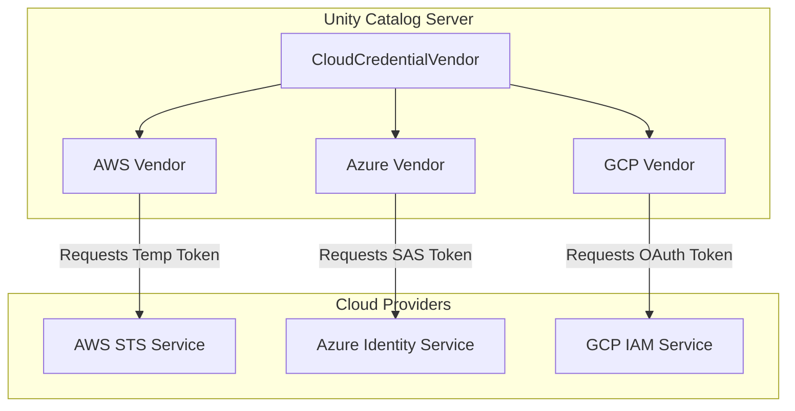
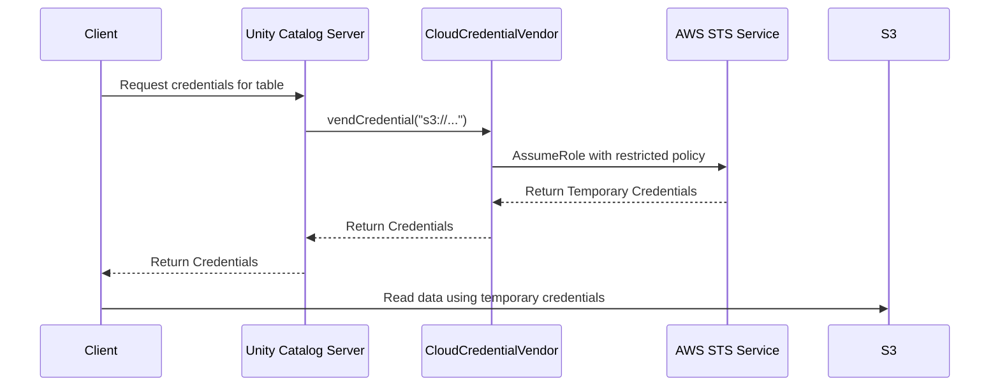

# Chapter 4: Temporary Credentials Vendor

In the [previous chapter](03_unity_catalog_server_.md), we explored the [Unity Catalog Server](03_unity_catalog_server_.md), the central brain that manages all the information *about* our data (the metadata). It knows what tables exist, where they are, and who is allowed to access them.

But there's a crucial distinction: the server manages the *catalog*, not the *actual data files*. The data itself lives in a secure cloud storage service like Amazon S3, Azure Data Lake Storage (ADLS), or Google Cloud Storage (GCS). This raises a critical security question: How do we give a user access to read the files for a specific table without handing over the powerful, permanent keys to our entire cloud storage account?

### The Problem: The Master Key to the Archive

Imagine our data is stored in a highly secure archive (like an S3 bucket). The [Unity Catalog Server](03_unity_catalog_server_.md) is the head librarian who knows exactly where every document is located.

Now, a researcher (a user) is approved to read a single document. Should the librarian give them the master key that opens every single room and filing cabinet in the entire archive? Absolutely not! That would be a massive security risk. What if the key is lost or stolen?

We need a system that can create a special, temporary key-card that:
1.  Only opens the one specific filing cabinet the researcher needs.
2.  Works for only a short period of time (e.g., one hour).
3.  Is logged and audited.

This is precisely the problem the Temporary Credentials Vendor solves for cloud data access.

### The Solution: A Secure Key-Card Dispenser

The **Temporary Credentials Vendor** is a component within the Unity Catalog Server that acts like a smart, secure key-card dispenser. Instead of exposing the server's own long-term, powerful cloud credentials, it generates secure, short-lived credentials for clients.

When a user is authorized to read a table, they don't get the server's master key. Instead, the server asks the `CloudCredentialVendor` to generate a temporary "key-card." This "card" could be:
*   An **AWS STS Token** for data in S3.
*   An **Azure SAS Token** for data in ADLS.
*   A **GCP OAuth Token** for data in GCS.

These credentials grant the user access **only** to the specific data they requested, for a **limited time**. This is a fundamental security principle called the "principle of least privilege."



The `CloudCredentialVendor` is the main coordinator, which delegates the actual work to a specialist for each cloud provider.

### Under the Hood: A User Reads a Table

Let's follow a data analyst who wants to read a table stored in an S3 bucket.

1.  The analyst's tool (like a data science notebook) asks the Unity Catalog Server: "I need to read the table `production.sales.revenue_2023`. Can I have temporary credentials?"
2.  The server's `TableService` first checks with the [Authorization Framework](02_authorization_framework_.md): "Does this analyst have `SELECT` permission on this table?"
3.  The authorizer says "Yes."
4.  The `TableService` gets the table's storage location, which is `s3://my-company-data/sales/revenue/`.
5.  The service then calls the `CloudCredentialVendor`, asking it to generate read-only credentials for that specific S3 path.
6.  The `CloudCredentialVendor` sees the `s3://` prefix and passes the request to its specialist, the `AwsCredentialVendor`.
7.  The `AwsCredentialVendor` securely connects to the real AWS Security Token Service (STS) and requests a temporary token. It includes a policy that says: "This token should only be allowed to read files inside the `my-company-data/sales/revenue/` folder."
8.  AWS STS generates the short-lived credentials (an access key, secret key, and session token) and sends them back.
9.  These credentials are passed all the way back to the analyst's tool.
10. The analyst's tool now uses these temporary credentials to connect **directly** to S3 and read the data files. The Unity Catalog Server is no longer involved in this step.

Here's a simplified diagram of this flow:



### A Glimpse into the Code

Let's look at how the code orchestrates this.

#### The Main Coordinator: `CloudCredentialVendor.java`

This central class is surprisingly simple. Its main job is to look at the path (e.g., `s3://...`) and delegate to the correct specialist.

```java
// From: server/src/main/java/io/unitycatalog/server/service/credential/CloudCredentialVendor.java

public TemporaryCredentials vendCredential(CredentialContext context) {
    // Get the storage scheme, e.g., "s3" or "gs"
    String storageScheme = context.getStorageScheme();
    
    switch (storageScheme) {
      case "abfss": // Azure
        // Delegate to the Azure specialist
        vendAzureCredential(context);
        break;
      case "gs": // Google Cloud
        // Delegate to the GCP specialist
        vendGcpToken(context);
        break;

      case "s3": // AWS
        // Delegate to the AWS specialist
        vendAwsCredential(context);
        break;
    }
    // ... package and return the credentials
}
```
This `switch` statement is the core logic, acting as a traffic cop directing the request to the right vendor based on the storage location.

#### The AWS Specialist: `AwsCredentialVendor.java`

This class handles the specifics of talking to AWS. It builds a policy that restricts access and then calls the AWS API.

```java
// From: server/src/main/java/io/unitycatalog/server/service/credential/aws/AwsCredentialVendor.java

public Credentials vendAwsCredentials(CredentialContext context) {
    // ... get the STS client configured for AWS ...
    StsClient stsClient = getStsClientForStorageConfig(...);

    // Generate a very specific, restrictive security policy
    String awsPolicy =
        AwsPolicyGenerator.generatePolicy(context.getPrivileges(), context.getLocations());

    // Ask AWS to assume a role with our restrictive policy
    return stsClient
        .assumeRole(
            r -> r.roleArn(...)
                  .policy(awsPolicy) // Apply the restriction
                  .durationSeconds(3600)) // Expire in 1 hour
        .credentials();
}
```
This code shows the two most important steps: generating a hyper-specific policy and then calling `assumeRole` to get the temporary credentials that are bound by that policy. The `AzureCredentialVendor` and `GcpCredentialVendor` follow similar patterns for their respective cloud platforms.

#### The Public API

Finally, how does a client ask for these credentials? The server exposes a clear set of API endpoints for this purpose.

```markdown
# From: api/Apis/TemporaryCredentialsApi.md

# Generate temporary table credentials.
POST /temporary-table-credentials

# Generate temporary volume credentials.
POST /temporary-volume-credentials
```

A client application makes a `POST` request to one of these endpoints, providing the name of the asset it wants to access, and the server returns the temporary credentials in the response.

### Conclusion

You've just learned about a critical security feature: the **Temporary Credentials Vendor**. This system ensures that direct access to data files in cloud storage is secure, audited, and time-bound. It acts as a trusted broker, issuing short-lived, narrowly-scoped "key-cards" on demand. This prevents the exposure of powerful, long-term cloud keys and strictly enforces the principle of least privilege.

So far, we've explored how the server is organized, how it's secured, and how it manages data access. But how do we define all these API endpoints in a clear, consistent, and machine-readable way?

In the next chapter, we'll dive into the blueprint for our entire API: the [OpenAPI Specification](05_openapi_specification_.md).

---

Generated by [AI Codebase Knowledge Builder](https://github.com/The-Pocket/Tutorial-Codebase-Knowledge)