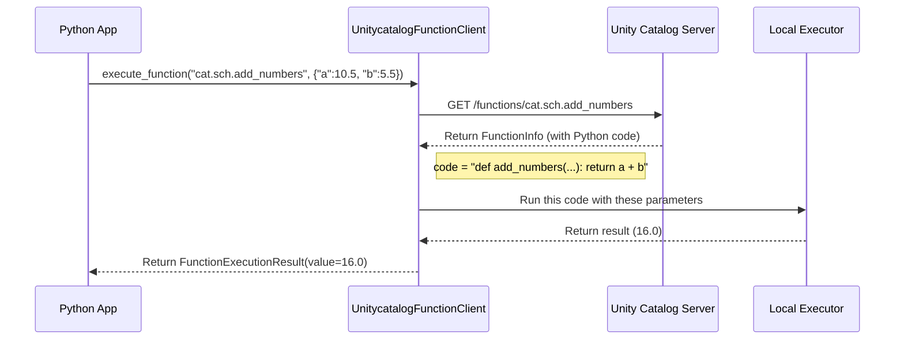

# Chapter 6: Unity Catalog AI Client

In the [previous chapter](05_openapi_specification_.md), we saw how the [OpenAPI Specification](05_openapi_specification_.md) acts as the master blueprint for our entire system. It's the detailed, technical manual that defines every possible interaction with our data library.

But if you're a data scientist or an AI developer working in Python, you don't want to read a technical manual and craft raw HTTP requests just to get your work done. You need a simple, intuitive tool that speaks your language. This chapter introduces the **Unity Catalog AI Client**, the friendly Python library that acts as your personal "smart library app."

### The Problem: We Need a Steering Wheel, Not an Engine Schematic

Imagine you've just been given the complete, highly detailed engineering schematics for a car engine ([OpenAPI Specification](05_openapi_specification_.md)). Now, you're told to drive the car from Point A to Point B. You wouldn't start by connecting wires and adjusting fuel lines yourself! You'd look for a steering wheel, pedals, and a dashboard.

This is the exact problem the AI Client solves. The [Unity Catalog Server](03_unity_catalog_server_.md) has a powerful API, but using it directly from Python is cumbersome. We need a user-friendly interface that handles all the complex communication for us.

### The Solution: A Smart App for Your Data Library

The **Unity Catalog AI Client** is a specialized Python library designed specifically for AI and Machine Learning workflows. Think of it as a smart library app on your phone. Instead of having to know the library's internal procedures, you just tap buttons to:
*   **Register a new "skill"**: Take a normal Python function and register it in Unity Catalog with one line of code.
*   **Look up a skill**: Get information about any function stored in the catalog.
*   **Use a skill**: This is the most important part! You can ask the client to *execute* any registered function by name, passing it the inputs it needs.

This client is the foundation that allows us to treat functions stored in Unity Catalog as callable "tools" for AI agents. It comes in two main flavors:
1.  `UnitycatalogFunctionClient`: For the open-source server we've been learning about.
2.  `DatabricksFunctionClient`: A specialized version for working in the Databricks environment.

For this tutorial, we will focus on the `UnitycatalogFunctionClient`.

### A Step-by-Step Guide to Using the AI Client

Let's see how easy it is to use this client to manage and run a function.

#### Step 1: Connect to the Library

First, we need to initialize the client and tell it the address of our Unity Catalog Server.

```python
from unitycatalog.ai.core.client import UnitycatalogFunctionClient
from unitycatalog.client import ApiClient, Configuration

# Point the client to our server's API endpoint
config = Configuration(host="http://localhost:8080/api/2.1/unity-catalog")
api_client = ApiClient(configuration=config)

# Create our smart library app instance!
uc_client = UnitycatalogFunctionClient(api_client=api_client)
```
This code sets up our connection. The `uc_client` is now ready to talk to the server on our behalf.

#### Step 2: Register a New Python Function

Imagine you have a simple Python function. With the AI Client, registering it in Unity Catalog is incredibly simple.

```python
def add_numbers(a: float, b: float) -> float:
    """Adds two numbers and returns the result."""
    return a + b

# Register the function in our catalog and schema
function_info = uc_client.create_python_function(
    func=add_numbers,
    catalog="my_catalog",
    schema="my_schema",
)

print("Function registered!")
```
**What just happened?** The `create_python_function` method is very clever. It looked at your `add_numbers` function and automatically understood its:
*   **Name**: `add_numbers`
*   **Inputs**: `a` (a float) and `b` (a float), thanks to the type hints.
*   **Output**: a `float`.
*   **Description**: "Adds two numbers and returns the result," from the docstring.

It packaged all this information into a valid API request and sent it to the server. Your simple Python function is now a registered asset!

#### Step 3: Execute the Function as a "Tool"

This is the most powerful feature. You can now execute that function *by its Unity Catalog name*, without needing the original Python code.

```python
# The full "address" of our function
full_function_name = "my_catalog.my_schema.add_numbers"

# Tell the client to run it with these inputs
result = uc_client.execute_function(
    full_function_name,
    parameters={"a": 10.5, "b": 5.5}
)

print(result.value)
```

**Output:**
```
16.0
```
The client found the function in Unity Catalog, ran its code with the parameters you provided, and gave you back the result. You've successfully used a centrally-managed function as a callable tool!

### Under the Hood: How Does `execute_function` Work?

This process seems like magic, but it's a straightforward sequence of steps orchestrated by the client.

1.  Your Python app calls `execute_function`.
2.  The **AI Client** asks the **Unity Catalog Server** for the details of `my_catalog.my_schema.add_numbers`.
3.  The **Server** sends back the `FunctionInfo` object, which includes the function's Python code as a simple string.
4.  The **AI Client** takes this code string and gives it to a secure **Local Executor**.
5.  The **Executor** runs the code in a safe, isolated environment with the provided parameters (`a=10.5`, `b=5.5`).
6.  The result (`16.0`) is returned to the client, which then passes it back to your app.

Here’s a diagram of that flow:



#### A Glimpse into the Code

Let's look at a simplified version of the client's `execute_function_async` method from the source code.

```python
# Simplified from: ai/core/src/unitycatalog/ai/core/client.py

async def execute_function_async(self, function_name: str, parameters: dict):
    # 1. Get the function's metadata from the server
    function_info = self.get_function(function_name)

    # 2. Prepare the function by turning its code string into a real callable
    func, final_params = self._prepare_function_and_params(
        function_info, parameters
    )

    # 3. Execute the function in a secure sandbox
    succeeded, result = await run_in_sandbox_async(func, final_params)

    # ... handle the result and return it ...
    return FunctionExecutionResult(value=result)
```

The key steps are right there:
1.  `get_function()`: Fetches the function's definition from the server.
2.  `_prepare_function_and_params()`: This is the "magic" part. It takes the Python code stored as a string inside `function_info` and uses Python's `exec()` to turn it into a real, runnable function object. It also intelligently caches the function so it doesn't have to do this every time.
3.  `run_in_sandbox_async()`: For security, the client doesn't run the code in its own process. It runs it in an isolated "sandbox" to prevent a misbehaving or malicious function from affecting your main application.

### Conclusion

You've now learned about the **Unity Catalog AI Client**, the essential tool for any Python developer working with `unitycatalog`. This client transforms the powerful server API into a simple, intuitive library.

*   It acts as a **smart interface**, simplifying the creation, management, and execution of functions.
*   Its most important job is to **execute registered functions by name**, turning your Unity Catalog into a repository of callable tools.
*   It securely **runs code locally** in a sandboxed environment, providing both convenience and safety.

This ability to treat remote functions as local tools is the critical bridge to the world of AI. Now that we have this foundation, we can plug it into popular AI frameworks.

In the next chapter, we'll see how this client enables powerful [AI Toolkit Integrations](07_ai_toolkit_integrations_.md).

---

Generated by [AI Codebase Knowledge Builder](https://github.com/The-Pocket/Tutorial-Codebase-Knowledge)