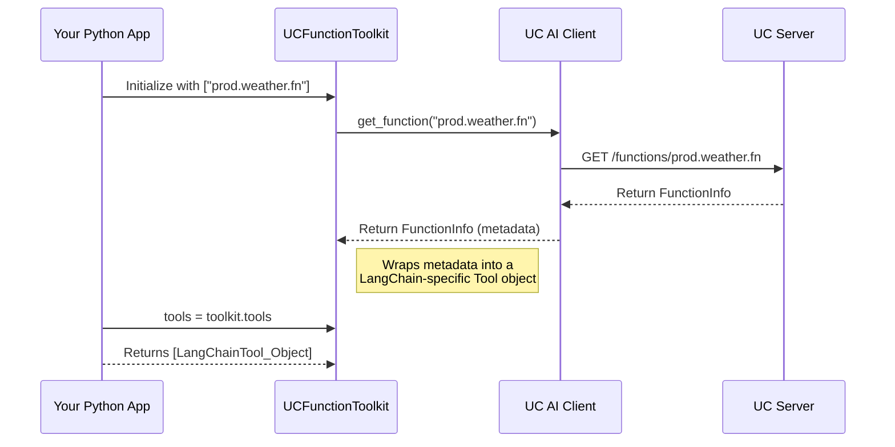

# Chapter 7: AI Toolkit Integrations

In the [previous chapter](06_unity_catalog_ai_client_.md), we discovered the [Unity Catalog AI Client](06_unity_catalog_ai_client_.md), our smart Python "app" for interacting with our data library. We learned how to use it to register Python functions and, most importantly, execute them by name, turning Unity Catalog into a repository of callable tools.

This is a fantastic foundation, but how do we connect these tools to the powerful AI assistants and agents we want to build? Frameworks like LangChain, CrewAI, and OpenAI each have their own specific way of understanding what a "tool" is. They speak different languages. This chapter introduces the "universal translators" that bridge this gap: the **AI Toolkit Integrations**.

### The Problem: Different Plugs for Different Sockets

Imagine you have a fantastic, high-tech power tool (our function in Unity Catalog). You travel to different countries to get your work done, but each country has a different type of electrical socket. Your tool's plug won't fit!

This is the exact challenge we face.
*   **LangChain** expects a tool to be a specific `StructuredTool` object.
*   **CrewAI** expects a `BaseTool` object.
*   The **OpenAI API** expects a specific JSON format to describe a function.

If we want our centrally-managed `get_current_weather` function from Unity Catalog to be usable by an AI agent built with LangChain, we need to manually write "adapter" code to wrap it in the exact format LangChain expects. Doing this for every function and every framework would be tedious, repetitive, and error-prone. We need a set of pre-built travel adapters.

### The Solution: A Box of Universal Adapters

The **AI Toolkit Integrations** are a collection of small, specialized Python packages that act as these universal adapters. For each popular AI framework, there is a corresponding integration that provides a simple class: `UCFunctionToolkit`.

Think of this toolkit as a magic box. You tell it two things:
1.  Which functions from Unity Catalog you want to use (e.g., `["prod.weather.get_current_weather"]`).
2.  Which AI framework you're using (by importing the correct toolkit).

The `UCFunctionToolkit` then automatically reaches into Unity Catalog, gets all the information about your functions, and instantly creates a list of perfectly formatted "tool" objects that your chosen AI framework can understand and use immediately. No manual wrapping, no boilerplate code.

```mermaid
graph TD
    subgraph "Unity Catalog"
        A[get_current_weather (Function)]
        B[send_email (Function)]
    end

    subgraph "Your Python App"
        C(UCFunctionToolkit for LangChain) --> D{List of LangChain Tools};
        E(UCFunctionToolkit for CrewAI) --> F{List of CrewAI Tools};
        G(UCFunctionToolkit for OpenAI) --> H{List of OpenAI Tools};
    end

    A -- "catalog.schema.get_current_weather" --> C
    A -- "catalog.schema.get_current_weather" --> E
    A -- "catalog.schema.get_current_weather" --> G
    
    D --> I[LangChain Agent]
    F --> J[CrewAI Agent]
    H --> K[OpenAI Chat]

    style C fill:#cde4ff,stroke:#6699ff,stroke-width:2px
    style E fill:#cde4ff,stroke:#6699ff,stroke-width:2px
    style G fill:#cde4ff,stroke:#6699ff,stroke-width:2px
```

This diagram shows how the same function in Unity Catalog can be effortlessly adapted into the native tool format for three different frameworks using the corresponding `UCFunctionToolkit`.

### A Step-by-Step Guide: Using Unity Catalog Functions with LangChain

Let's build a simple AI agent with LangChain that can use a function from our catalog.

#### Step 1: Install the LangChain Integration

First, you need the specific adapter package for LangChain.

```bash
pip install unitycatalog-ai-langchain
```
This command installs the necessary components to bridge `unitycatalog` and LangChain.

#### Step 2: Create the Toolkit

Now, in your Python code, you simply import `UCFunctionToolkit` from the LangChain integration and give it the names of the functions you want your agent to use.

```python
from unitycatalog.ai.langchain import UCFunctionToolkit

# The full addresses of the functions we want to use
function_names = ["prod.weather.get_current_weather"]

# Create the toolkit. This does all the work!
toolkit = UCFunctionToolkit(function_names=function_names)
```
Behind the scenes, the toolkit is already talking to the [Unity Catalog Server](03_unity_catalog_server_.md) to get the details of your function.

#### Step 3: Give the Tools to Your Agent

The toolkit has a convenient `.tools` property that gives you the list of ready-to-use LangChain tools. You can pass this list directly to your LangChain agent.

```python
# This is a simplified example of creating a LangChain agent
from langchain_openai import ChatOpenAI
from langchain.agents import AgentExecutor, create_tool_calling_agent

# Get the list of perfectly formatted LangChain tools
tools = toolkit.tools

# Create your agent and give it the tools
llm = ChatOpenAI(model="gpt-4o")
# ... create a prompt (not shown for simplicity)
agent = create_tool_calling_agent(llm, tools, prompt)
agent_executor = AgentExecutor(agent=agent, tools=tools)

# Now the agent knows how to use your function!
agent_executor.invoke({"input": "What is the weather in New York?"})
```
That's it! You've successfully equipped a sophisticated AI agent with a governed, versioned function from Unity Catalog in just a few lines of code. The agent can now intelligently decide when to call `get_current_weather` based on the user's question.

### Under the Hood: How the Toolkit Works

The process is simple but powerful, combining the [Unity Catalog AI Client](06_unity_catalog_ai_client_.md) with a framework-specific wrapper.

1.  When you create `UCFunctionToolkit(function_names=...)`, it initializes an instance of the [Unity Catalog AI Client](06_unity_catalog_ai_client_.md).
2.  It loops through each `function_name` you provided.
3.  For each name, it calls `client.get_function()` to fetch the function's metadata from the server. This metadata includes its description, input parameters, and their types.
4.  It then passes this metadata to a special helper function, like `uc_function_to_langchain_tool`.
5.  This helper function creates a `UnityCatalogTool` object (which is a type of LangChain `StructuredTool`), carefully mapping the description and parameters from Unity Catalog into the fields LangChain expects.
6.  The most important part: the tool's actual executable code is a small wrapper that calls `client.execute_function()`.
7.  The final, perfectly formatted tool is stored. The `.tools` property simply gives you a list of these generated objects.

Here's a diagram of the initialization process:



### A Glimpse into the Code

Let's look at a simplified piece of the `uc_function_to_langchain_tool` method to see the "translation" in action.

```python
# Simplified from: ai/integrations/langchain/src/unitycatalog/ai/langchain/toolkit.py

def uc_function_to_langchain_tool(function_name: str, client):
    # 1. Get metadata from Unity Catalog
    function_info = client.get_function(function_name)

    # 2. Define the wrapper that LangChain will execute
    def func(**kwargs):
        # This wrapper calls our trusty AI Client!
        result = client.execute_function(function_name, kwargs)
        return result.to_json()

    # 3. Create the LangChain tool object
    return UnityCatalogTool(
        name=get_tool_name(function_name),
        description=function_info.comment, # UC description -> LangChain description
        func=func,                         # The wrapper is the tool's action
        args_schema=...                    # UC parameters -> LangChain schema
    )
```
This snippet reveals the core magic:
1.  It fetches the function's "manual" from Unity Catalog.
2.  It creates a small `func` that knows how to use our standard [Unity Catalog AI Client](06_unity_catalog_ai_client_.md) to run the function.
3.  It builds the final `UnityCatalogTool` object, mapping the fields directly. The function's `comment` in Unity Catalog becomes the `description` that the LangChain agent sees.

This same pattern is repeated for every integration (CrewAI, OpenAI, etc.), providing a consistent and effortless developer experience across the entire AI ecosystem.

### Conclusion

You've just learned about the final piece of the puzzle for building powerful AI applications: the **AI Toolkit Integrations**. These simple adapter packages are the crucial bridge between your centrally-managed, secure functions in Unity Catalog and the fast-moving world of AI frameworks.

*   They act as **universal adapters**, eliminating boilerplate code.
*   The `UCFunctionToolkit` class provides a consistent, one-line way to make UC functions available to any supported framework.
*   They empower you to build sophisticated AI agents that can use governed, versioned, and production-ready tools without leaving their native environment.

We've now covered the entire lifecycle, from organizing assets and securing them, to running the server and building intelligent clients. The final step is to learn how to deploy this entire system in a real-world, scalable production environment.

In the next chapter, we will explore [Helm Chart Deployment](08_helm_chart_deployment_.md).

---

Generated by [AI Codebase Knowledge Builder](https://github.com/The-Pocket/Tutorial-Codebase-Knowledge)