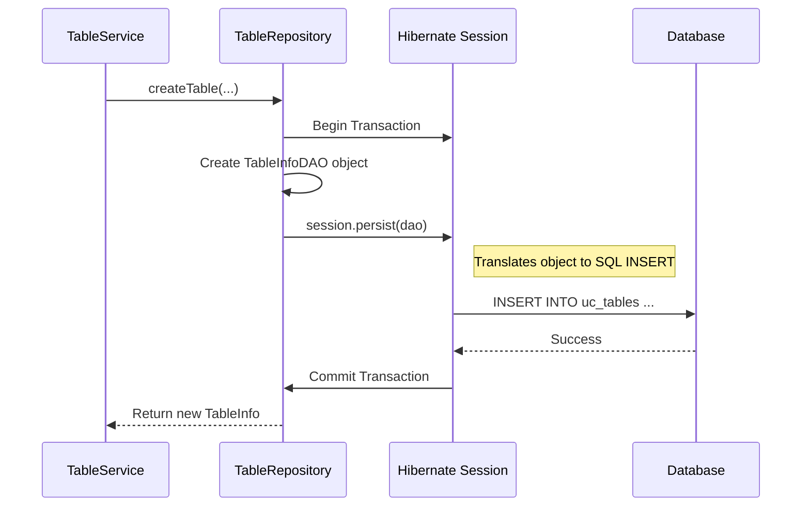

# Chapter 9: Persistence Layer (Repositories & DAOs)

In the [previous chapter](08_helm_chart_deployment_.md), we learned how to deploy the entire `unitycatalog` application as a complete package using the [Helm Chart Deployment](08_helm_chart_deployment_.md). With our application now running in a production-like environment, it's time to look inside the server one last time and understand how it remembers everything. How does it store and retrieve information about our catalogs, schemas, and tables?

This chapter dives into the server's memory bank: the **Persistence Layer**.

### The Problem: The Librarian Needs a Filing System

Imagine our [Unity Catalog Server](03_unity_catalog_server_.md) is a busy head librarian. A user comes to the desk and says, "I'd like to create a new table called `quarterly_sales`."

The librarian's service (`TableService`) handles the request and checks with security (`Authorizer`) that the user has permission. Now what? The librarian can't just remember this new table in their head. They need a robust, organized system to:
1.  Write down the details of the new table on an index card.
2.  File that card in the correct drawer of the card catalog.
3.  Ensure the filing process is done correctly and safely every single time.

If every part of the server tried to manage its own filing system, the code would become a tangled mess of database commands, making it impossible to maintain and easy to corrupt data. We need a clean, centralized system for talking to the database.

### The Solution: Filing Clerks and Index Cards

The `unitycatalog` server solves this with a classic, powerful pattern that separates the "what" from the "how" of data storage. Think of it as a two-part filing system:

1.  **DAOs (Data Access Objects):** These are the blank **index cards**. A DAO is a simple Java class that is a direct, one-to-one copy of a database table's structure. For example, `CatalogInfoDAO` has fields for `name`, `comment`, and `owner`, just like the `uc_catalogs` table in the database. Its only job is to hold data.
2.  **Repositories:** These are the expert **filing clerks**. Each repository is a specialist for a single type of asset. The `TableRepository` is the expert who knows all the rules and procedures for creating, finding, and deleting table index cards. It takes instructions from the librarian (`TableService`) and uses the DAOs (index cards) to interact with the database.

This system is powered by a technology called **Hibernate**, which is like a magical pneumatic tube system that automatically sends the index cards to the right filing cabinets (database tables) without the clerk needing to know the exact physical path.

```mermaid
graph TD
    A[TableService<br>(The Librarian)] --> B[TableRepository<br>(The Expert Filing Clerk)];
    B -- "Uses" --> C[TableInfoDAO<br>(The Index Card)];
    C -- "Sent via" --> D[Hibernate<br>(Pneumatic Tubes)];
    D --> E[(Database<br>The Filing Cabinet)];

    style C fill:#cde4ff,stroke:#6699ff,stroke-width:2px
    style B fill:#cde4ff,stroke:#6699ff,stroke-width:2px
```

This separation is key: the `TableService` only needs to talk to the `TableRepository`; it never has to worry about the messy details of index cards or databases.

### 1. The Index Card: `CatalogInfoDAO.java`

A DAO is a simple blueprint. Let's look at a simplified `CatalogInfoDAO`. The special `@` annotations are instructions for Hibernate, telling it how this "index card" maps to a database "filing cabinet."

```java
// From: server/src/main/java/io/unitycatalog/server/persist/dao/CatalogInfoDAO.java

@Entity // This class is an "index card" that can be stored.
@Table(name = "uc_catalogs") // It goes into the 'uc_catalogs' filing cabinet.
public class CatalogInfoDAO {
    @Id // This is the unique ID for the card.
    private UUID id;

    @Column(name = "name") // This field maps to the 'name' column.
    private String name;

    @Column(name = "comment")
    private String comment;
    // ... other fields like owner, created_at, etc.
}
```
This class doesn't *do* anything; it's just a container for information, perfectly mirroring a row in the database table.

### 2. The Filing Clerk: `CatalogRepository.java`

A Repository contains the logic. It's the worker that knows how to perform tasks like "create a catalog" or "get a catalog by name." It hides all the complexity of database sessions and transactions from the rest of the application.

```java
// Simplified from CatalogRepository.java
public class CatalogRepository {
    private final SessionFactory sessionFactory; // The connection to the pneumatic tubes

    public CatalogInfo createCatalog(CreateCatalog createCatalog) {
        // Use a helper to ensure this whole process is one safe transaction
        return TransactionManager.executeWithTransaction(sessionFactory, session -> {
            // Create a new blank index card (DAO)
            CatalogInfoDAO catalogInfoDAO = new CatalogInfoDAO();
            catalogInfoDAO.setName(createCatalog.getName());
            catalogInfoDAO.setComment(createCatalog.getComment());
            
            // Tell the tube system to file the new card
            session.persist(catalogInfoDAO);

            // Convert the card back to a plain info object to return
            return catalogInfoDAO.toCatalogInfo();
        }, "Error creating catalog");
    }
}
```
This code shows the clean separation of duties. The repository handles creating the DAO, saving it within a safe transaction, and returning the result.

### Under the Hood: Creating a Table

Let's follow the full journey of our user's request to create the `quarterly_sales` table.

1.  The `TableService` receives the request. It has already checked permissions.
2.  It calls `tableRepository.createTable(...)`, passing along the details.
3.  The `TableRepository` starts a new, safe database **transaction**. This is critical—it means that if any step fails, the entire operation is undone, leaving the database in a clean state.
4.  The repository first looks up the parent schema to get its ID, ensuring the table has a valid home.
5.  It creates a new `TableInfoDAO` object (our index card) and fills it with the table's name, comment, storage location, etc.
6.  It then calls `session.persist(tableInfoDAO)`. This is the key moment!
7.  **Hibernate** (the pneumatic tube system) sees this and automatically generates the correct SQL `INSERT` statement.
8.  Hibernate sends this SQL command to the database. The database adds a new row to the `uc_tables` table.
9.  The repository **commits** the transaction, making the change permanent.
10. It converts the saved DAO back into a regular `TableInfo` object and returns it to the `TableService`, which sends a success response to the user.

Here is a diagram of that flow:



#### The Transaction Guardian: `TransactionManager.java`

Every single database write operation in `unitycatalog` is protected by the `TransactionManager`. This small utility class ensures that work is done safely.

```java
// From: server/src/main/java/io/unitycatalog/server/persist/utils/TransactionManager.java

public static <R> R executeWithTransaction(
      SessionFactory sessionFactory, DatabaseOperation<R> operation) {
    
    try (Session session = sessionFactory.openSession()) {
      Transaction tx = session.beginTransaction();
      try {
        R result = operation.execute(session); // Do the real work
        tx.commit(); // If successful, make it permanent
        return result;
      } catch (Exception e) {
        tx.rollback(); // If anything goes wrong, undo everything!
        throw new BaseException(...);
      }
    }
}
```
This "wrapper" pattern is what provides the safety net. The repository's logic is the `operation`, and the `TransactionManager` guarantees it either succeeds completely or is rolled back as if it never happened.

### Conclusion

You've just explored the very foundation of the server's state management: the **Persistence Layer**. This elegant design, with its separation of concerns, is what allows the server to manage data safely and reliably.

*   **DAOs** are the simple "index cards" that mirror the database tables.
*   **Repositories** are the "expert filing clerks" that contain all the business logic for interacting with the database for a specific asset type.
*   This layer abstracts away the raw SQL, making the rest of the server code cleaner, safer, and easier to understand.

Congratulations! You have now journeyed through all the core concepts of the `unitycatalog` project. From the high-level [Three-Level Namespace](01_three_level_namespace__catalog___schema___asset__.md) and [Authorization Framework](02_authorization_framework_.md), through the engine of the [Unity Catalog Server](03_unity_catalog_server_.md), to the user-facing [AI Toolkit Integrations](07_ai_toolkit_integrations_.md), and finally to the practicalities of [Helm Chart Deployment](08_helm_chart_deployment_.md) and the persistence layer you've just learned.

You now have a complete, end-to-end understanding of how this powerful system is designed, built, and operated.

---

Generated by [AI Codebase Knowledge Builder](https://github.com/The-Pocket/Tutorial-Codebase-Knowledge)