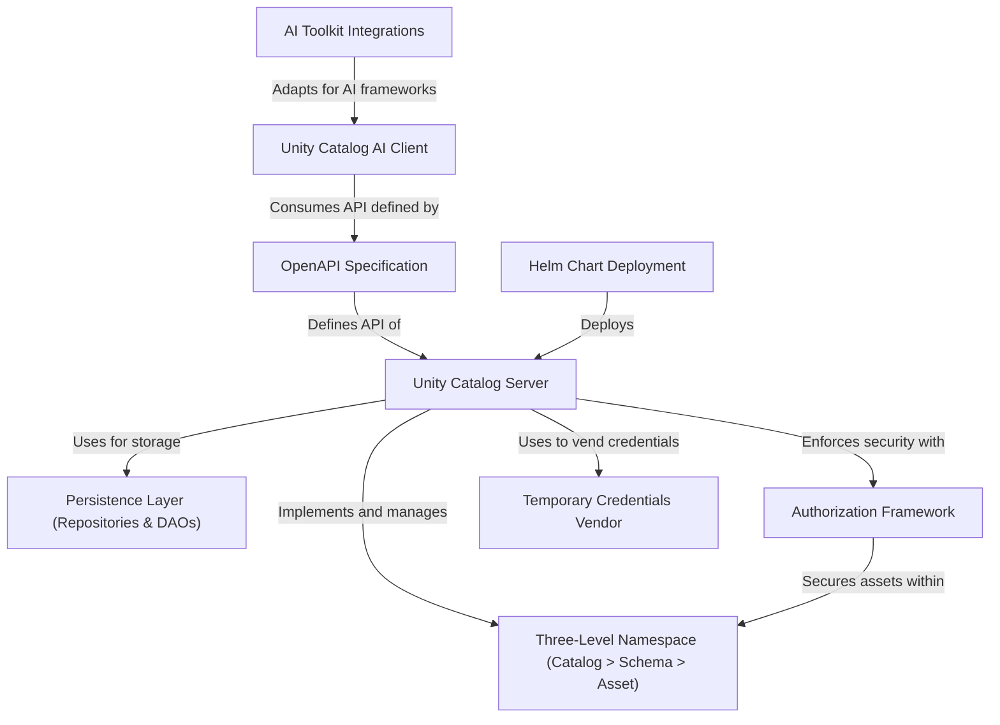

# Tutorial: unitycatalog

The `unitycatalog` project is a backend **server** for managing data and AI assets. It organizes everything into a logical *three-level namespace* (catalog > schema > asset), making it easy to find and govern things like tables, ML models, and functions. The server enforces security through a robust **authorization framework** and provides secure, short-lived access to data using a *temporary credentials system*. A key feature is its AI integration, offering a specialized **Python client** and toolkit adapters that allow AI agents (like those from LangChain or OpenAI) to use registered functions as callable "tools". The entire application is designed to be easily deployed on Kubernetes using a **Helm chart**.

**Source Repository:** [None](None)

## Chapters

1. [Three-Level Namespace (Catalog > Schema > Asset)
](01_three_level_namespace__catalog___schema___asset__.md)
2. [Authorization Framework
](02_authorization_framework_.md)
3. [Unity Catalog Server
](03_unity_catalog_server_.md)
4. [Temporary Credentials Vendor
](04_temporary_credentials_vendor_.md)
5. [OpenAPI Specification
](05_openapi_specification_.md)
6. [Unity Catalog AI Client
](06_unity_catalog_ai_client_.md)
7. [AI Toolkit Integrations
](07_ai_toolkit_integrations_.md)
8. [Helm Chart Deployment
](08_helm_chart_deployment_.md)
9. [Persistence Layer (Repositories & DAOs)
](09_persistence_layer__repositories___daos__.md)

---

Generated by [AI Codebase Knowledge Builder](https://github.com/The-Pocket/Tutorial-Codebase-Knowledge)